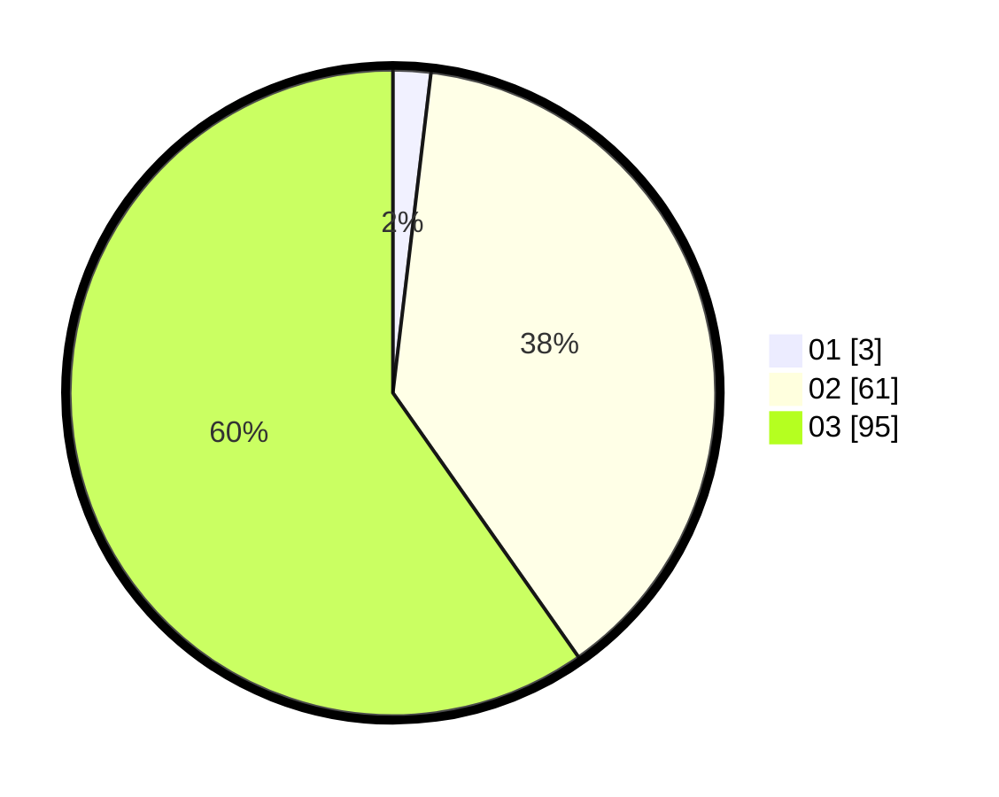

# Hasil

Hasil perolehan suara paslon dapat dilihat pada file paslon-01.txt, paslon-02.txt, dan paslon-03.txt.

Jika tidak ada, artinya data tersebut belum ada pada SIREKAP.

## Perolehan Suara

 * Paslon 01: **3**.
 * Paslon 02: **61**.
 * Paslon 03: **95**.

## Foto C Plano

https://sirekap-obj-formc.kpu.go.id/b828/pemilu/ppwp/31/73/03/10/01/3173031001003-20240214-222547--a5cb78dd-0712-4fc5-87b3-593ac923b7a4.jpg

https://sirekap-obj-formc.kpu.go.id/b828/pemilu/ppwp/31/73/03/10/01/3173031001003-20240214-222621--eea3714d-3af4-4767-bc92-d4bbae73944f.jpg

https://sirekap-obj-formc.kpu.go.id/b828/pemilu/ppwp/31/73/03/10/01/3173031001003-20240214-222644--2f6bcdf8-7599-4f67-a062-cdf02ba31999.jpg
