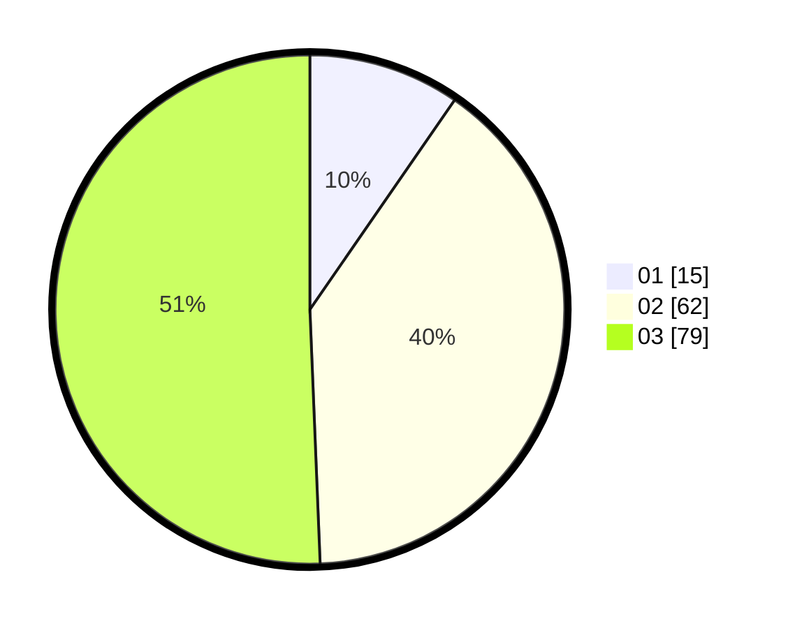

# Hasil

Hasil perolehan suara paslon dapat dilihat pada file paslon-01.txt, paslon-02.txt, dan paslon-03.txt.

Jika tidak ada, artinya data tersebut belum ada pada SIREKAP.

## Perolehan Suara

 * Paslon 01: **15**.
 * Paslon 02: **62**.
 * Paslon 03: **79**.

## Foto C Plano

https://sirekap-obj-formc.kpu.go.id/35bd/pemilu/ppwp/31/73/03/10/01/3173031001006-20240215-090143--4cb3b9ec-5cc4-4116-8b88-b1471c505de9.jpg

https://sirekap-obj-formc.kpu.go.id/35bd/pemilu/ppwp/31/73/03/10/01/3173031001006-20240215-090246--da50351f-b08d-4d0d-8894-b468b0ce6873.jpg

https://sirekap-obj-formc.kpu.go.id/35bd/pemilu/ppwp/31/73/03/10/01/3173031001006-20240215-090351--88c79adf-2b87-40ac-9703-6867cba8807c.jpg
