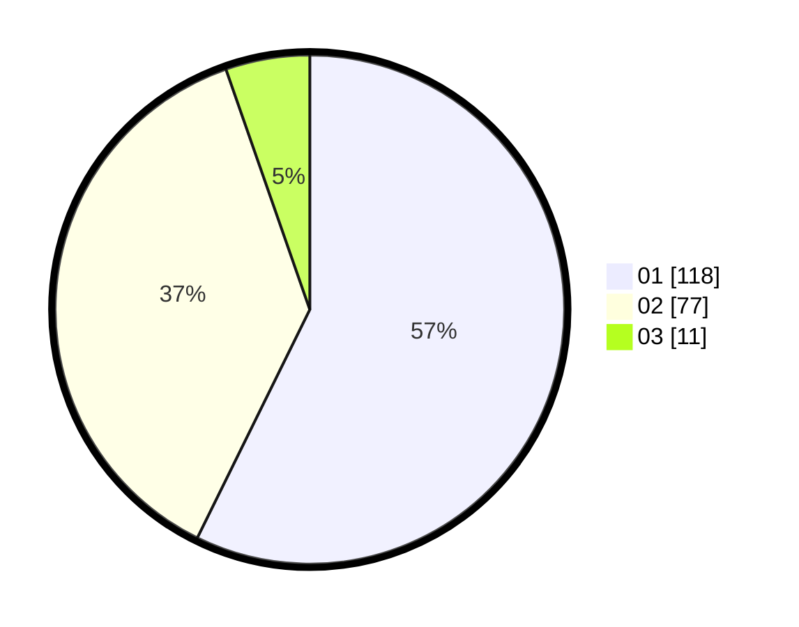

# Hasil

Hasil perolehan suara paslon dapat dilihat pada file paslon-01.txt, paslon-02.txt, dan paslon-03.txt.

Jika tidak ada, artinya data tersebut belum ada pada SIREKAP.

## Perolehan Suara

 * Paslon 01: **118**.
 * Paslon 02: **77**.
 * Paslon 03: **11**.

## Foto C Plano

https://sirekap-obj-formc.kpu.go.id/4b06/pemilu/ppwp/31/73/03/10/01/3173031001010-20240215-000136--fbd45918-fe8f-4247-8269-900be777f073.jpg

https://sirekap-obj-formc.kpu.go.id/4b06/pemilu/ppwp/31/73/03/10/01/3173031001010-20240215-000232--0a1eadf5-2cee-47cf-a2f8-276af48a5082.jpg

https://sirekap-obj-formc.kpu.go.id/4b06/pemilu/ppwp/31/73/03/10/01/3173031001010-20240215-000358--a49924d3-c351-47e4-be6d-59f19dcc4b26.jpg
