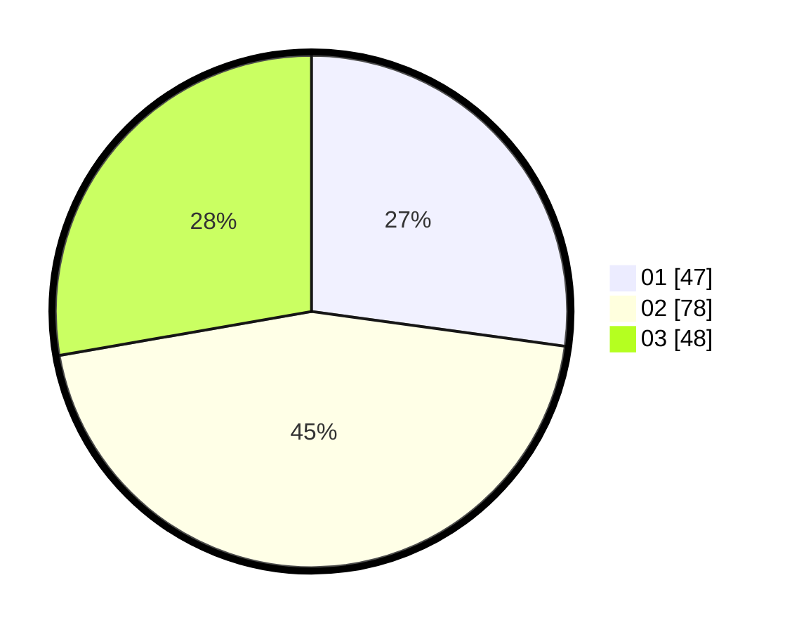

# Hasil

Hasil perolehan suara paslon dapat dilihat pada file paslon-01.txt, paslon-02.txt, dan paslon-03.txt.

Jika tidak ada, artinya data tersebut belum ada pada SIREKAP.

## Perolehan Suara

 * Paslon 01: **47**.
 * Paslon 02: **78**.
 * Paslon 03: **48**.

## Foto C Plano

https://sirekap-obj-formc.kpu.go.id/d914/pemilu/ppwp/31/73/03/10/01/3173031001012-20240214-201751--a60c6ede-ef6f-4b73-b83f-7858be211ceb.jpg

https://sirekap-obj-formc.kpu.go.id/d914/pemilu/ppwp/31/73/03/10/01/3173031001012-20240214-201611--690f30c1-4e2e-4358-bf03-e21a3774bfe8.jpg

https://sirekap-obj-formc.kpu.go.id/d914/pemilu/ppwp/31/73/03/10/01/3173031001012-20240214-201715--fb329cb6-939c-4f9c-82c3-df2f41ab0623.jpg
