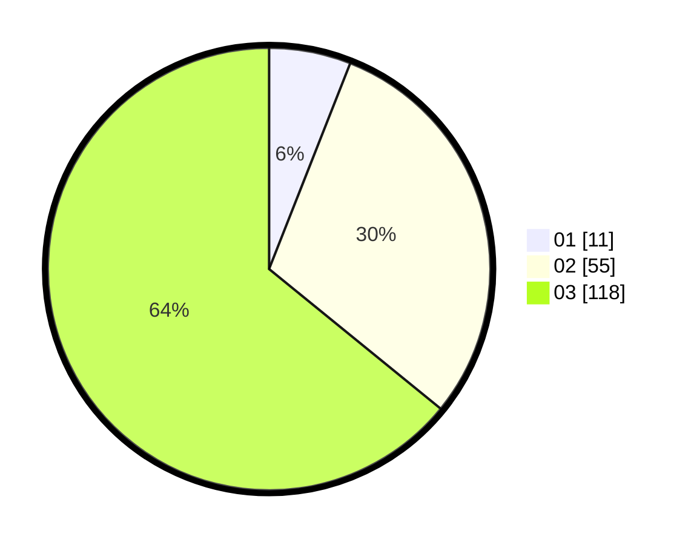

# Hasil

Hasil perolehan suara paslon dapat dilihat pada file paslon-01.txt, paslon-02.txt, dan paslon-03.txt.

Jika tidak ada, artinya data tersebut belum ada pada SIREKAP.

## Perolehan Suara

 * Paslon 01: **11**.
 * Paslon 02: **55**.
 * Paslon 03: **118**.

## Foto C Plano

https://sirekap-obj-formc.kpu.go.id/bf88/pemilu/ppwp/31/73/03/10/01/3173031001016-20240214-222818--05ee1bfd-ffe3-45c3-8bb2-07249332db6e.jpg

https://sirekap-obj-formc.kpu.go.id/bf88/pemilu/ppwp/31/73/03/10/01/3173031001016-20240214-222822--15d9cef1-5d32-4f61-bc83-b9f078a0770b.jpg
