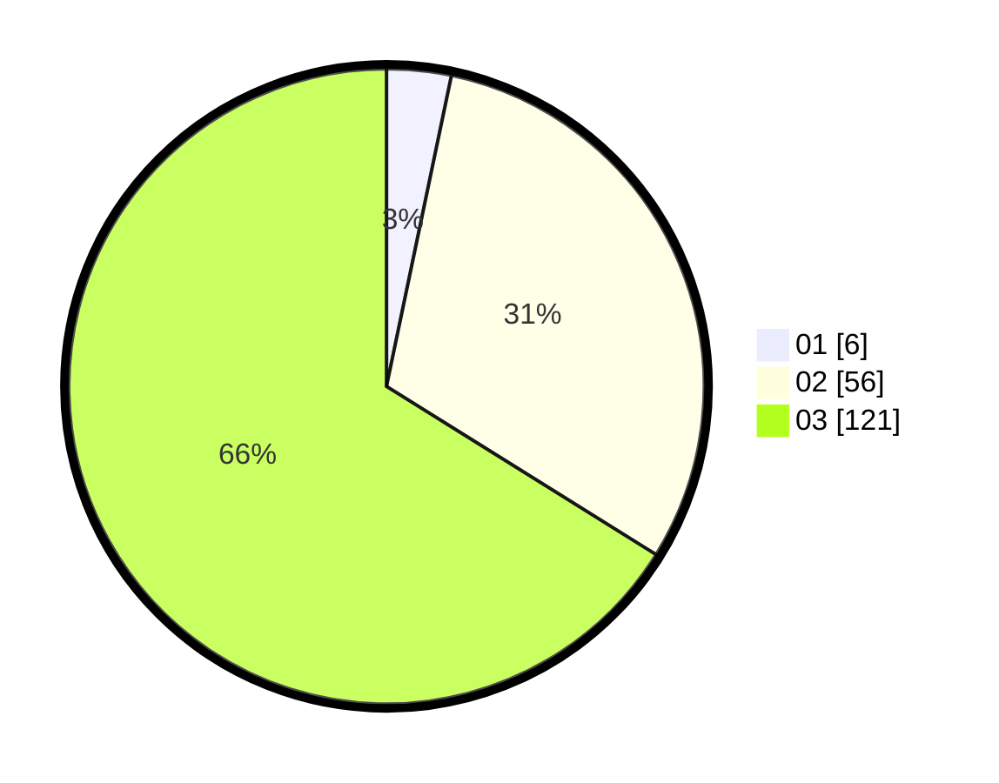

# Hasil

Hasil perolehan suara paslon dapat dilihat pada file paslon-01.txt, paslon-02.txt, dan paslon-03.txt.

Jika tidak ada, artinya data tersebut belum ada pada SIREKAP.

## Perolehan Suara

 * Paslon 01: **6**.
 * Paslon 02: **56**.
 * Paslon 03: **121**.

## Foto C Plano

https://sirekap-obj-formc.kpu.go.id/c14b/pemilu/ppwp/31/73/03/10/01/3173031001017-20240214-223254--d3544de1-d7ce-4abd-a357-b63100dc30ab.jpg

https://sirekap-obj-formc.kpu.go.id/c14b/pemilu/ppwp/31/73/03/10/01/3173031001017-20240214-223323--2837cb1c-0fbd-4fa8-988f-4b317dcc7393.jpg

https://sirekap-obj-formc.kpu.go.id/c14b/pemilu/ppwp/31/73/03/10/01/3173031001017-20240214-223305--3155b059-661c-4af9-965d-e759f2ed3aa8.jpg

## DATA PEMILIH TETAP

Jumlah pemilih dalam DPT: **238**.
 * L: **98**.
 * P: **140**.

## DATA PENGGUNA HAK PILIH

Jumlah pengguna hak pilih dalam DPT: **179**.
 * L: **74**.
 * P: **105**.

Jumlah pengguna hak pilih dalam DPTb: **3**.
 * L: **0**.
 * P: **3**.

Jumlah pengguna hak pilih dalam DPK: **3**.
 * L: **1**.
 * P: **2**.

Jumlah pengguna hak pilih: **185**.
 * L: **75**.
 * P: **110**.

## JUMLAH SUARA SAH DAN TIDAK SAH

JUMLAH SELURUH SUARA SAH: **183**.

JUMLAH SUARA TIDAK SAH: **2**.

JUMLAH SELURUH SUARA SAH DAN SUARA TIDAK SAH: **185**.
