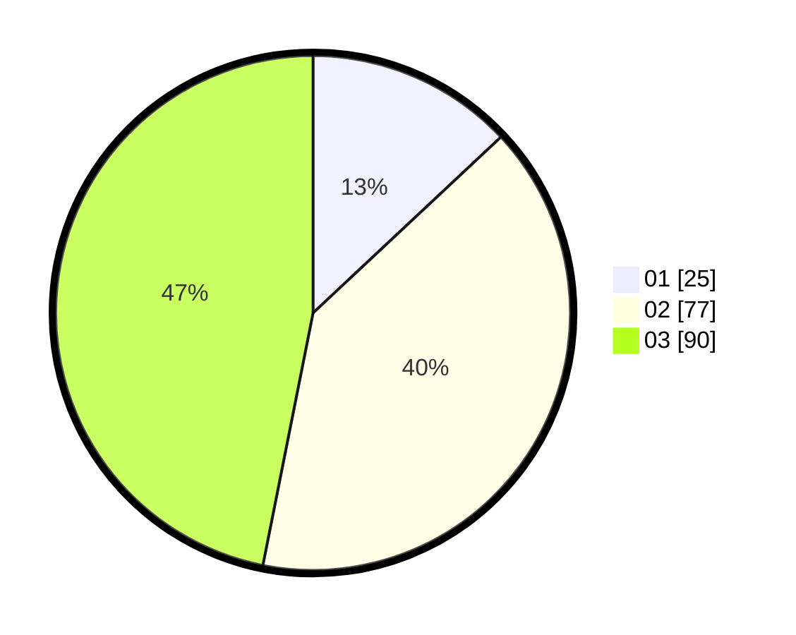

# Hasil

Hasil perolehan suara paslon dapat dilihat pada file paslon-01.txt, paslon-02.txt, dan paslon-03.txt.

Jika tidak ada, artinya data tersebut belum ada pada SIREKAP.

## Perolehan Suara

 * Paslon 01: **25**.
 * Paslon 02: **77**.
 * Paslon 03: **90**.

## Foto C Plano

https://sirekap-obj-formc.kpu.go.id/b3e8/pemilu/ppwp/31/73/03/10/01/3173031001019-20240214-195033--93011c7e-38d9-462f-a409-065f28ec91db.jpg

https://sirekap-obj-formc.kpu.go.id/b3e8/pemilu/ppwp/31/73/03/10/01/3173031001019-20240214-221429--c9c14a38-9233-4eaf-8cbe-cabfce925e87.jpg

https://sirekap-obj-formc.kpu.go.id/b3e8/pemilu/ppwp/31/73/03/10/01/3173031001019-20240214-221446--2ad652fd-0b81-4b81-aa8c-372bf0277460.jpg

## DATA PEMILIH TETAP

Jumlah pemilih dalam DPT: **254**.
 * L: **129**.
 * P: **125**.

## DATA PENGGUNA HAK PILIH

Jumlah pengguna hak pilih dalam DPT: **185**.
 * L: **95**.
 * P: **84**.

Jumlah pengguna hak pilih dalam DPTb: **5**.
 * L: **3**.
 * P: **3**.

Jumlah pengguna hak pilih dalam DPK: **1**.
 * L: **1**.
 * P: **0**.

Jumlah pengguna hak pilih: **142**.
 * L: **100**.
 * P: **42**.

## JUMLAH SUARA SAH DAN TIDAK SAH

JUMLAH SELURUH SUARA SAH: **192**.

JUMLAH SUARA TIDAK SAH: **0**.

JUMLAH SELURUH SUARA SAH DAN SUARA TIDAK SAH: **192**.
