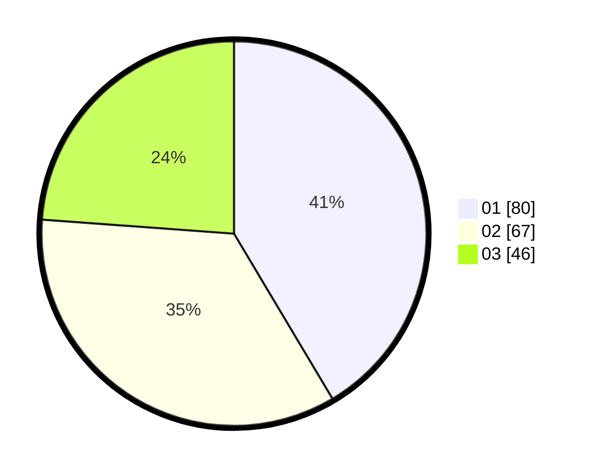

# Hasil

Hasil perolehan suara paslon dapat dilihat pada file paslon-01.txt, paslon-02.txt, dan paslon-03.txt.

Jika tidak ada, artinya data tersebut belum ada pada SIREKAP.

## Perolehan Suara

 * Paslon 01: **80**.
 * Paslon 02: **67**.
 * Paslon 03: **46**.

## Foto C Plano

https://sirekap-obj-formc.kpu.go.id/72ed/pemilu/ppwp/31/73/03/10/01/3173031001022-20240214-215740--4235b3a9-aad2-409a-943a-d45c8b7dab9a.jpg

https://sirekap-obj-formc.kpu.go.id/72ed/pemilu/ppwp/31/73/03/10/01/3173031001022-20240214-212850--90702391-05f9-4251-93b8-c12d152486de.jpg

https://sirekap-obj-formc.kpu.go.id/72ed/pemilu/ppwp/31/73/03/10/01/3173031001022-20240214-215838--cdeb6335-983b-435d-875b-a99c666ff34c.jpg
