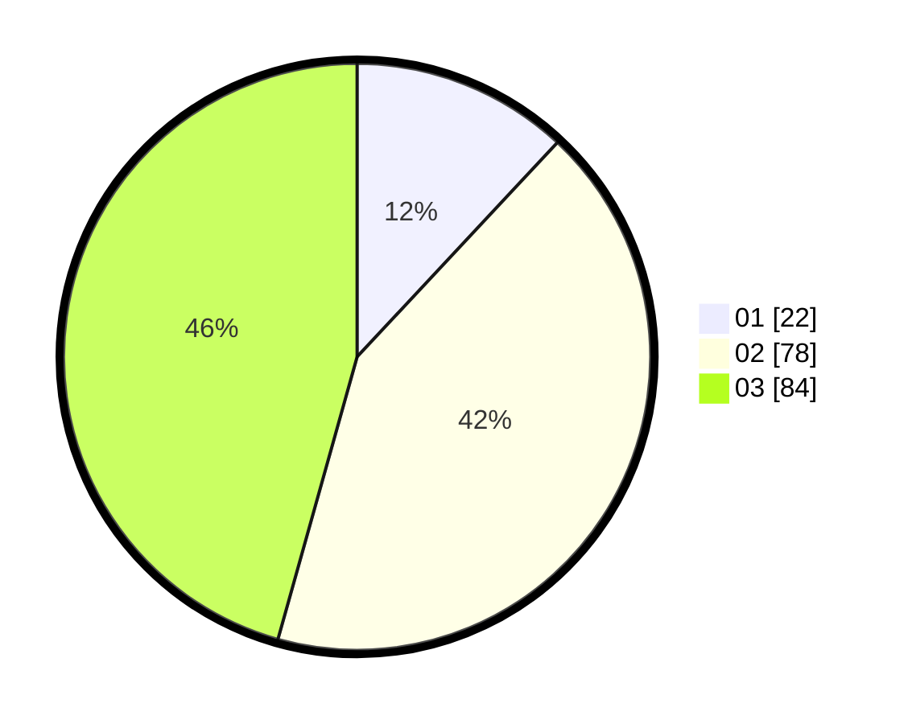

# Hasil

Hasil perolehan suara paslon dapat dilihat pada file paslon-01.txt, paslon-02.txt, dan paslon-03.txt.

Jika tidak ada, artinya data tersebut belum ada pada SIREKAP.

## Perolehan Suara

 * Paslon 01: **22**.
 * Paslon 02: **78**.
 * Paslon 03: **84**.

## Foto C Plano

https://sirekap-obj-formc.kpu.go.id/aac5/pemilu/ppwp/31/73/03/10/01/3173031001025-20240215-215732--79aa99d5-87b4-4f5e-8ecd-0c0c3f2b22a9.jpg

https://sirekap-obj-formc.kpu.go.id/aac5/pemilu/ppwp/31/73/03/10/01/3173031001025-20240215-215735--1f75224c-7059-4492-aa74-ab9f0a712bcb.jpg

https://sirekap-obj-formc.kpu.go.id/aac5/pemilu/ppwp/31/73/03/10/01/3173031001025-20240215-215734--bcd028f8-99d9-4524-8c88-e6e73a8f2e98.jpg

## DATA PEMILIH TETAP

Jumlah pemilih dalam DPT: **238**.
 * L: **105**.
 * P: **133**.

## DATA PENGGUNA HAK PILIH

Jumlah pengguna hak pilih dalam DPT: **177**.
 * L: **74**.
 * P: **103**.

Jumlah pengguna hak pilih dalam DPTb: **0**.
 * L: **0**.
 * P: **0**.

Jumlah pengguna hak pilih dalam DPK: **9**.
 * L: **3**.
 * P: **6**.

Jumlah pengguna hak pilih: **186**.
 * L: **77**.
 * P: **109**.

## JUMLAH SUARA SAH DAN TIDAK SAH

JUMLAH SELURUH SUARA SAH: **184**.

JUMLAH SUARA TIDAK SAH: **2**.

JUMLAH SELURUH SUARA SAH DAN SUARA TIDAK SAH: **186**.
