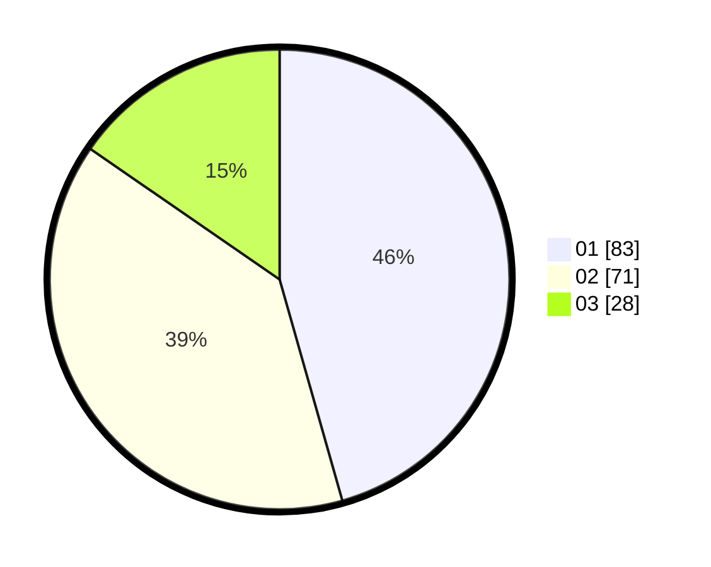

# Hasil

Hasil perolehan suara paslon dapat dilihat pada file paslon-01.txt, paslon-02.txt, dan paslon-03.txt.

Jika tidak ada, artinya data tersebut belum ada pada SIREKAP.

## Perolehan Suara

 * Paslon 01: **83**.
 * Paslon 02: **71**.
 * Paslon 03: **28**.

## Foto C Plano

https://sirekap-obj-formc.kpu.go.id/247a/pemilu/ppwp/31/73/03/10/01/3173031001026-20240214-231732--4fff1c93-067a-49ca-afed-9d5a0c6e190e.jpg

https://sirekap-obj-formc.kpu.go.id/247a/pemilu/ppwp/31/73/03/10/01/3173031001026-20240214-231844--8fd8b68c-8edd-4bc1-923e-2580e2d51b0e.jpg

https://sirekap-obj-formc.kpu.go.id/247a/pemilu/ppwp/31/73/03/10/01/3173031001026-20240215-011347--661db7ce-eef0-4b70-978f-d97ff3d346ad.jpg
