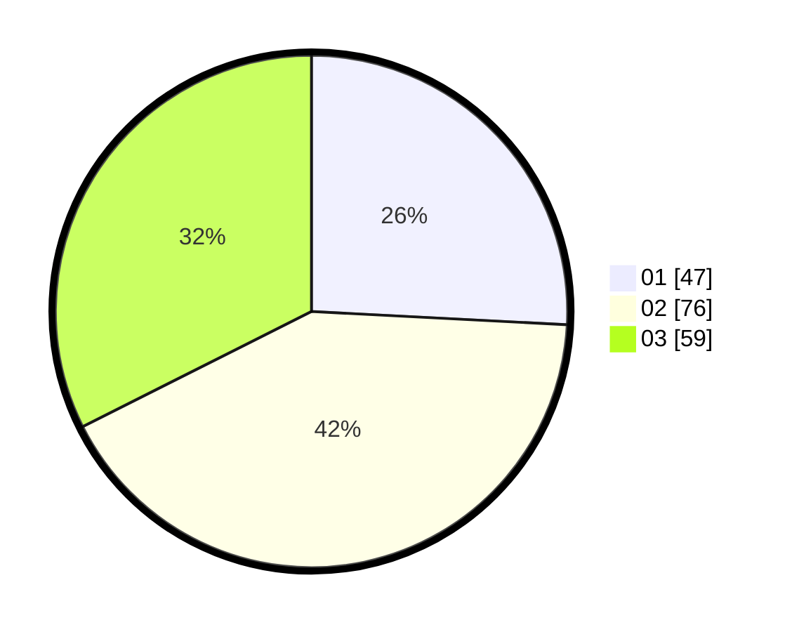

# Hasil

Hasil perolehan suara paslon dapat dilihat pada file paslon-01.txt, paslon-02.txt, dan paslon-03.txt.

Jika tidak ada, artinya data tersebut belum ada pada SIREKAP.

## Perolehan Suara

 * Paslon 01: **47**.
 * Paslon 02: **76**.
 * Paslon 03: **59**.

## Foto C Plano

https://sirekap-obj-formc.kpu.go.id/086a/pemilu/ppwp/31/73/03/10/01/3173031001029-20240215-202940--bbacb6a8-6423-4f34-b676-4f416f0fe7b4.jpg

https://sirekap-obj-formc.kpu.go.id/086a/pemilu/ppwp/31/73/03/10/01/3173031001029-20240216-010044--e45e6e36-9567-49f0-9c16-75aa3da0d433.jpg

https://sirekap-obj-formc.kpu.go.id/086a/pemilu/ppwp/31/73/03/10/01/3173031001029-20240216-010043--2dce18f6-ceb9-448a-9a24-5af0b050fa7a.jpg

## DATA PEMILIH TETAP

Jumlah pemilih dalam DPT: **242**.
 * L: **122**.
 * P: **120**.

## DATA PENGGUNA HAK PILIH

Jumlah pengguna hak pilih dalam DPT: **181**.
 * L: **92**.
 * P: **89**.

Jumlah pengguna hak pilih dalam DPTb: **1**.
 * L: **0**.
 * P: **1**.

Jumlah pengguna hak pilih dalam DPK: **3**.
 * L: **1**.
 * P: **2**.

Jumlah pengguna hak pilih: **185**.
 * L: **94**.
 * P: **91**.

## JUMLAH SUARA SAH DAN TIDAK SAH

JUMLAH SELURUH SUARA SAH: **182**.

JUMLAH SUARA TIDAK SAH: **3**.

JUMLAH SELURUH SUARA SAH DAN SUARA TIDAK SAH: **185**.
