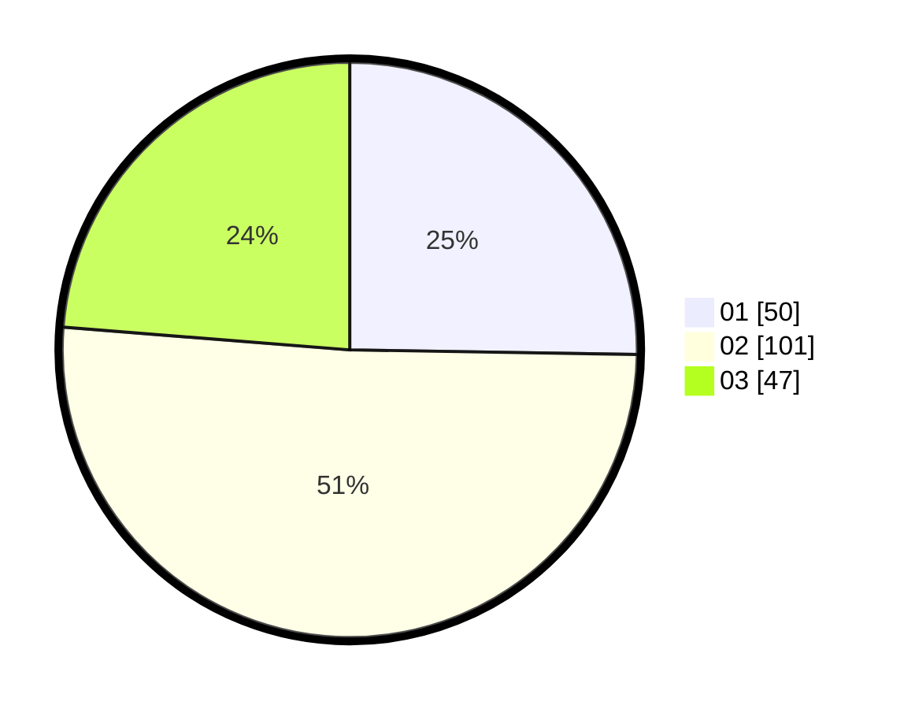

# Hasil

Hasil perolehan suara paslon dapat dilihat pada file paslon-01.txt, paslon-02.txt, dan paslon-03.txt.

Jika tidak ada, artinya data tersebut belum ada pada SIREKAP.

## Perolehan Suara

 * Paslon 01: **50**.
 * Paslon 02: **101**.
 * Paslon 03: **47**.

## Foto C Plano

https://sirekap-obj-formc.kpu.go.id/b07e/pemilu/ppwp/31/73/03/10/01/3173031001030-20240214-164028--fabf09b5-4093-4944-9384-3cef7759edf0.jpg

https://sirekap-obj-formc.kpu.go.id/b07e/pemilu/ppwp/31/73/03/10/01/3173031001030-20240214-164030--87070c0d-91b7-4fd1-a1d4-513ddaa8100d.jpg

https://sirekap-obj-formc.kpu.go.id/b07e/pemilu/ppwp/31/73/03/10/01/3173031001030-20240214-164029--1302d516-4934-4e31-9661-dd8d28b04e37.jpg

## DATA PEMILIH TETAP

Jumlah pemilih dalam DPT: **267**.
 * L: **133**.
 * P: **134**.

## DATA PENGGUNA HAK PILIH

Jumlah pengguna hak pilih dalam DPT: **193**.
 * L: **98**.
 * P: **95**.

Jumlah pengguna hak pilih dalam DPTb: **3**.
 * L: **0**.
 * P: **3**.

Jumlah pengguna hak pilih dalam DPK: **4**.
 * L: **1**.
 * P: **3**.

Jumlah pengguna hak pilih: **200**.
 * L: **99**.
 * P: **101**.

## JUMLAH SUARA SAH DAN TIDAK SAH

JUMLAH SELURUH SUARA SAH: **198**.

JUMLAH SUARA TIDAK SAH: **2**.

JUMLAH SELURUH SUARA SAH DAN SUARA TIDAK SAH: **200**.
