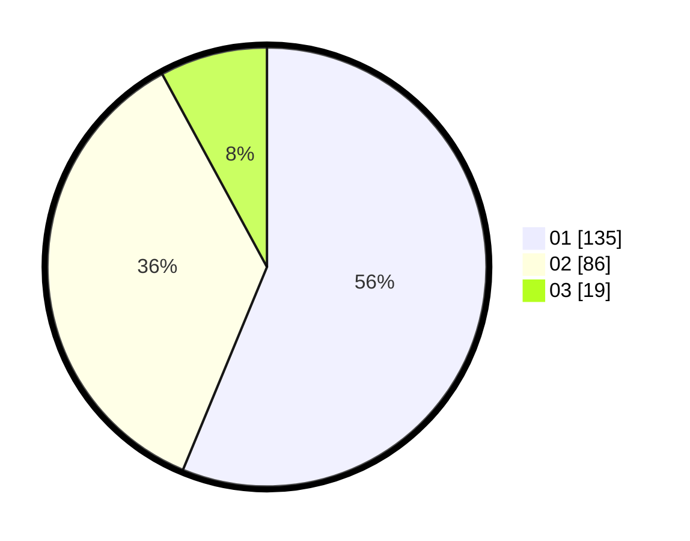

# Hasil

Hasil perolehan suara paslon dapat dilihat pada file paslon-01.txt, paslon-02.txt, dan paslon-03.txt.

Jika tidak ada, artinya data tersebut belum ada pada SIREKAP.

## Perolehan Suara

 * Paslon 01: **135**.
 * Paslon 02: **86**.
 * Paslon 03: **19**.

## Foto C Plano

https://sirekap-obj-formc.kpu.go.id/a581/pemilu/ppwp/31/73/03/10/01/3173031001041-20240214-214437--78d3d31a-2bd2-4386-8ebd-08ba4e66894f.jpg

https://sirekap-obj-formc.kpu.go.id/a581/pemilu/ppwp/31/73/03/10/01/3173031001041-20240214-213923--41c72a73-485a-4b0b-aa6e-a8f089886589.jpg
