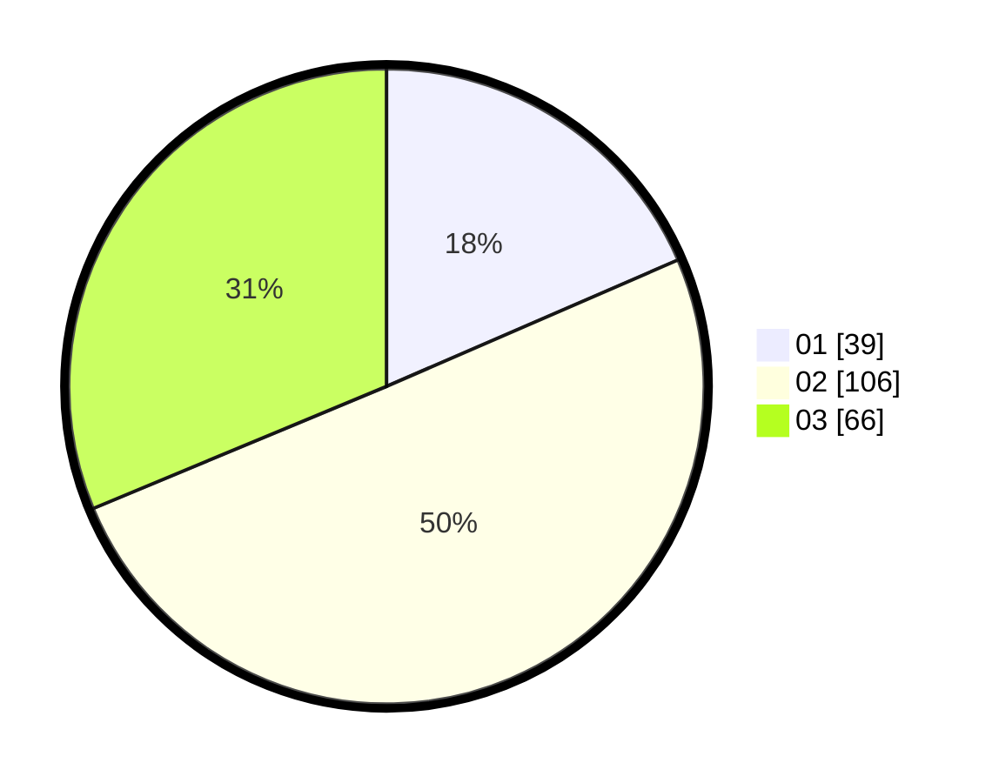

# Hasil

Hasil perolehan suara paslon dapat dilihat pada file paslon-01.txt, paslon-02.txt, dan paslon-03.txt.

Jika tidak ada, artinya data tersebut belum ada pada SIREKAP.

## Perolehan Suara

 * Paslon 01: **39**.
 * Paslon 02: **106**.
 * Paslon 03: **66**.

## Foto C Plano

https://sirekap-obj-formc.kpu.go.id/53d8/pemilu/ppwp/31/73/03/10/01/3173031001042-20240214-155107--db5dadc3-a0fd-4d76-8ca5-578c3c2781df.jpg

https://sirekap-obj-formc.kpu.go.id/53d8/pemilu/ppwp/31/73/03/10/01/3173031001042-20240214-162247--0c3cc056-c03e-4396-86aa-57ec80ee651e.jpg

https://sirekap-obj-formc.kpu.go.id/53d8/pemilu/ppwp/31/73/03/10/01/3173031001042-20240214-155426--2e9e5783-3910-4866-acfb-2c8a0efb8cd1.jpg

## DATA PEMILIH TETAP

Jumlah pemilih dalam DPT: **261**.
 * L: **126**.
 * P: **135**.

## DATA PENGGUNA HAK PILIH

Jumlah pengguna hak pilih dalam DPT: **209**.
 * L: **96**.
 * P: **113**.

Jumlah pengguna hak pilih dalam DPTb: **2**.
 * L: **1**.
 * P: **1**.

Jumlah pengguna hak pilih dalam DPK: **1**.
 * L: **1**.
 * P: **0**.

Jumlah pengguna hak pilih: **212**.
 * L: **98**.
 * P: **114**.

## JUMLAH SUARA SAH DAN TIDAK SAH

JUMLAH SELURUH SUARA SAH: **211**.

JUMLAH SUARA TIDAK SAH: **1**.

JUMLAH SELURUH SUARA SAH DAN SUARA TIDAK SAH: **212**.
