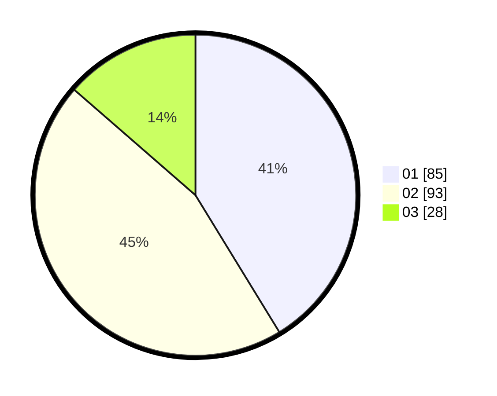

# Hasil

Hasil perolehan suara paslon dapat dilihat pada file paslon-01.txt, paslon-02.txt, dan paslon-03.txt.

Jika tidak ada, artinya data tersebut belum ada pada SIREKAP.

## Perolehan Suara

 * Paslon 01: **85**.
 * Paslon 02: **93**.
 * Paslon 03: **28**.

## Foto C Plano

https://sirekap-obj-formc.kpu.go.id/5ebb/pemilu/ppwp/31/73/03/10/01/3173031001043-20240215-010057--07f87acc-dce4-4f49-9a89-05ce7057a045.jpg

https://sirekap-obj-formc.kpu.go.id/5ebb/pemilu/ppwp/31/73/03/10/01/3173031001043-20240215-002044--f636dfe4-23e8-4770-9515-64a18586ae43.jpg

https://sirekap-obj-formc.kpu.go.id/5ebb/pemilu/ppwp/31/73/03/10/01/3173031001043-20240215-002137--1986fbfe-9ff7-44b4-85b8-de8bf20c910d.jpg
