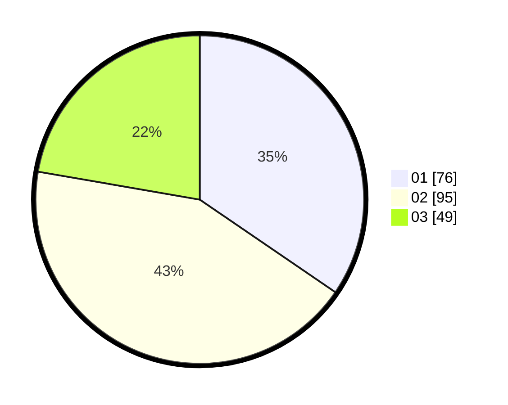

# Hasil

Hasil perolehan suara paslon dapat dilihat pada file paslon-01.txt, paslon-02.txt, dan paslon-03.txt.

Jika tidak ada, artinya data tersebut belum ada pada SIREKAP.

## Perolehan Suara

 * Paslon 01: **76**.
 * Paslon 02: **95**.
 * Paslon 03: **49**.

## Foto C Plano

https://sirekap-obj-formc.kpu.go.id/93ee/pemilu/ppwp/31/73/03/10/01/3173031001045-20240214-215253--b548f544-d747-4766-8a62-9313b3ac92b8.jpg

https://sirekap-obj-formc.kpu.go.id/93ee/pemilu/ppwp/31/73/03/10/01/3173031001045-20240214-215247--7a17f0ff-5d94-4148-b145-2723663c0002.jpg

https://sirekap-obj-formc.kpu.go.id/93ee/pemilu/ppwp/31/73/03/10/01/3173031001045-20240214-215239--af54bd9a-2af1-4ff0-bb34-5fb2e7bf4140.jpg
