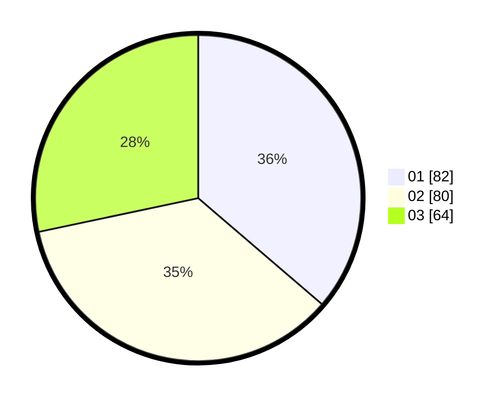

# Hasil

Hasil perolehan suara paslon dapat dilihat pada file paslon-01.txt, paslon-02.txt, dan paslon-03.txt.

Jika tidak ada, artinya data tersebut belum ada pada SIREKAP.

## Perolehan Suara

 * Paslon 01: **82**.
 * Paslon 02: **80**.
 * Paslon 03: **64**.

## Foto C Plano

https://sirekap-obj-formc.kpu.go.id/246f/pemilu/ppwp/31/73/03/10/01/3173031001046-20240216-144541--929eaf60-83c1-4b8e-99ec-f989e453548a.jpg

https://sirekap-obj-formc.kpu.go.id/246f/pemilu/ppwp/31/73/03/10/01/3173031001046-20240216-144543--b424edef-1ea8-423c-83ef-e5adbb01ccb5.jpg

https://sirekap-obj-formc.kpu.go.id/246f/pemilu/ppwp/31/73/03/10/01/3173031001046-20240216-144542--91b0b9d9-189b-4c23-a4b9-fdc015599660.jpg

## DATA PEMILIH TETAP

Jumlah pemilih dalam DPT: **295**.
 * L: **148**.
 * P: **147**.

## DATA PENGGUNA HAK PILIH

Jumlah pengguna hak pilih dalam DPT: **231**.
 * L: **110**.
 * P: **121**.

Jumlah pengguna hak pilih dalam DPTb: **5**.
 * L: **2**.
 * P: **3**.

Jumlah pengguna hak pilih dalam DPK: **0**.
 * L: **0**.
 * P: **0**.

Jumlah pengguna hak pilih: **236**.
 * L: **112**.
 * P: **124**.

## JUMLAH SUARA SAH DAN TIDAK SAH

JUMLAH SELURUH SUARA SAH: **226**.

JUMLAH SUARA TIDAK SAH: **10**.

JUMLAH SELURUH SUARA SAH DAN SUARA TIDAK SAH: **236**.
