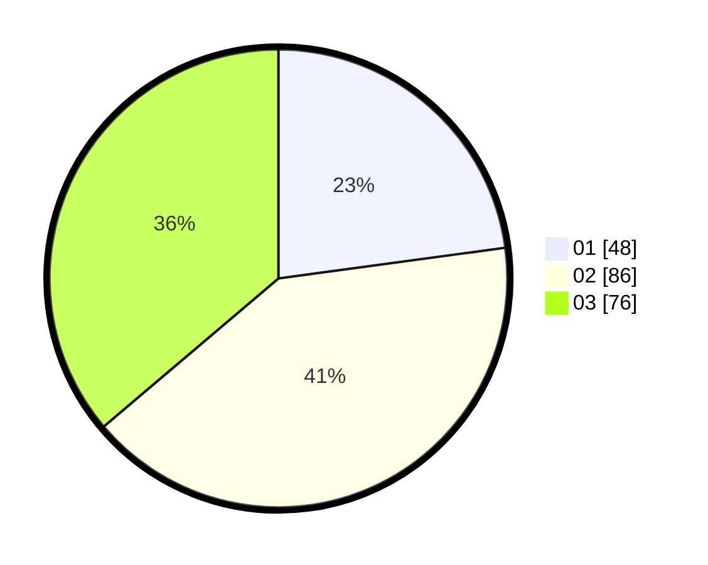

# Hasil

Hasil perolehan suara paslon dapat dilihat pada file paslon-01.txt, paslon-02.txt, dan paslon-03.txt.

Jika tidak ada, artinya data tersebut belum ada pada SIREKAP.

## Perolehan Suara

 * Paslon 01: **48**.
 * Paslon 02: **86**.
 * Paslon 03: **76**.

## Foto C Plano

https://sirekap-obj-formc.kpu.go.id/66f0/pemilu/ppwp/31/73/03/10/02/3173031002001-20240214-223716--3da75590-82c6-4b72-8dc0-a542ef6e598f.jpg

https://sirekap-obj-formc.kpu.go.id/66f0/pemilu/ppwp/31/73/03/10/02/3173031002001-20240214-224351--567b3070-16e8-4134-8706-ae182988b843.jpg

https://sirekap-obj-formc.kpu.go.id/66f0/pemilu/ppwp/31/73/03/10/02/3173031002001-20240214-224552--99a36a15-3b12-41cb-873f-3f71b85f03e8.jpg
