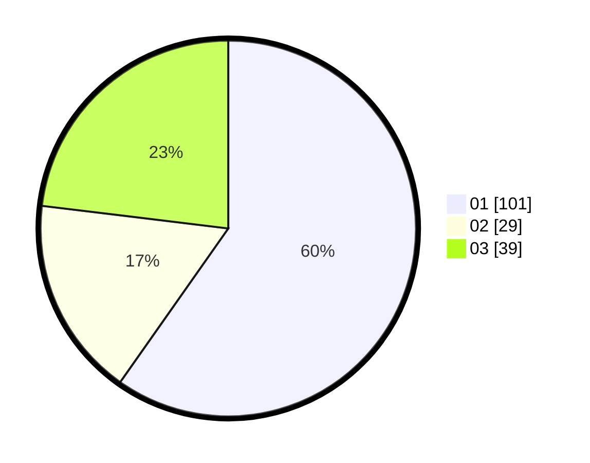

# Hasil

Hasil perolehan suara paslon dapat dilihat pada file paslon-01.txt, paslon-02.txt, dan paslon-03.txt.

Jika tidak ada, artinya data tersebut belum ada pada SIREKAP.

## Perolehan Suara

 * Paslon 01: **101**.
 * Paslon 02: **29**.
 * Paslon 03: **39**.

## Foto C Plano

https://sirekap-obj-formc.kpu.go.id/1756/pemilu/ppwp/31/73/03/10/02/3173031002003-20240214-185305--6d804396-db45-46d6-9555-a8f4ebe207a0.jpg

https://sirekap-obj-formc.kpu.go.id/1756/pemilu/ppwp/31/73/03/10/02/3173031002003-20240214-160101--41594a2b-637b-4708-8b84-ec61b3cea895.jpg

https://sirekap-obj-formc.kpu.go.id/1756/pemilu/ppwp/31/73/03/10/02/3173031002003-20240214-185317--627d8eed-73f6-406f-99a2-30049c573b80.jpg

## DATA PEMILIH TETAP

Jumlah pemilih dalam DPT: **261**.
 * L: **125**.
 * P: **136**.

## DATA PENGGUNA HAK PILIH

Jumlah pengguna hak pilih dalam DPT: **163**.
 * L: **71**.
 * P: **92**.

Jumlah pengguna hak pilih dalam DPTb: **6**.
 * L: **5**.
 * P: **1**.

Jumlah pengguna hak pilih dalam DPK: **0**.
 * L: **0**.
 * P: **0**.

Jumlah pengguna hak pilih: **169**.
 * L: **76**.
 * P: **93**.

## JUMLAH SUARA SAH DAN TIDAK SAH

JUMLAH SELURUH SUARA SAH: **169**.

JUMLAH SUARA TIDAK SAH: **0**.

JUMLAH SELURUH SUARA SAH DAN SUARA TIDAK SAH: **169**.
