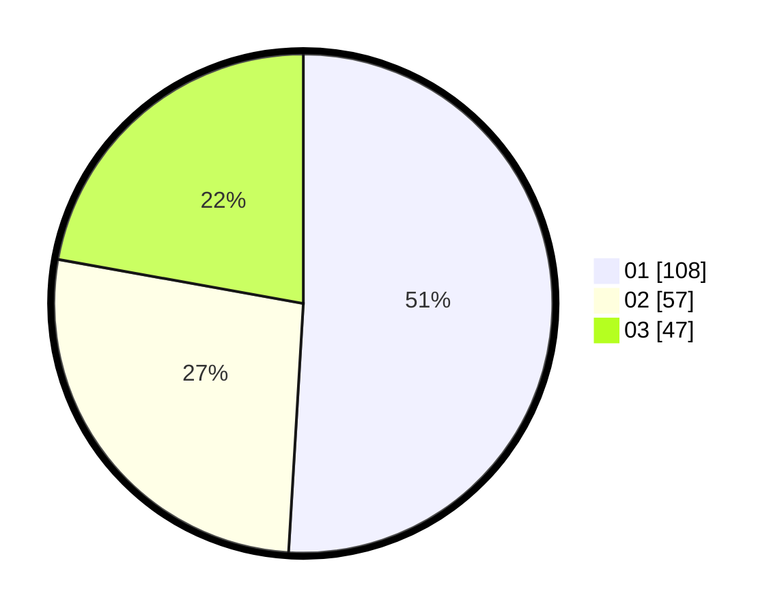

# Hasil

Hasil perolehan suara paslon dapat dilihat pada file paslon-01.txt, paslon-02.txt, dan paslon-03.txt.

Jika tidak ada, artinya data tersebut belum ada pada SIREKAP.

## Perolehan Suara

 * Paslon 01: **108**.
 * Paslon 02: **57**.
 * Paslon 03: **47**.

## Foto C Plano

https://sirekap-obj-formc.kpu.go.id/1183/pemilu/ppwp/31/73/03/10/02/3173031002004-20240214-235656--9970a62e-9916-4afd-bbe1-5f3a6adbf264.jpg

https://sirekap-obj-formc.kpu.go.id/1183/pemilu/ppwp/31/73/03/10/02/3173031002004-20240214-235908--39d0df60-292a-4662-ae0d-a190f878987c.jpg

https://sirekap-obj-formc.kpu.go.id/1183/pemilu/ppwp/31/73/03/10/02/3173031002004-20240214-235952--6278d48c-4d40-44cd-ae25-44d823fdc769.jpg
