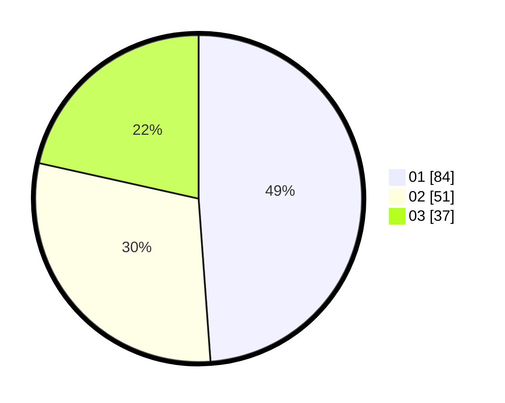

# Hasil

Hasil perolehan suara paslon dapat dilihat pada file paslon-01.txt, paslon-02.txt, dan paslon-03.txt.

Jika tidak ada, artinya data tersebut belum ada pada SIREKAP.

## Perolehan Suara

 * Paslon 01: **84**.
 * Paslon 02: **51**.
 * Paslon 03: **37**.

## Foto C Plano

https://sirekap-obj-formc.kpu.go.id/c242/pemilu/ppwp/31/73/03/10/02/3173031002007-20240215-113411--908fb9e5-7148-4029-9614-9137085ff8fb.jpg

https://sirekap-obj-formc.kpu.go.id/c242/pemilu/ppwp/31/73/03/10/02/3173031002007-20240215-113440--e691d877-866f-4772-86d7-e8934bc59f0f.jpg

https://sirekap-obj-formc.kpu.go.id/c242/pemilu/ppwp/31/73/03/10/02/3173031002007-20240215-113422--a4fae26d-e2b6-4690-99a9-e0c76771a853.jpg

## DATA PEMILIH TETAP

Jumlah pemilih dalam DPT: **241**.
 * L: **106**.
 * P: **135**.

## DATA PENGGUNA HAK PILIH

Jumlah pengguna hak pilih dalam DPT: **178**.
 * L: **78**.
 * P: **100**.

Jumlah pengguna hak pilih dalam DPTb: **1**.
 * L: **0**.
 * P: **1**.

Jumlah pengguna hak pilih dalam DPK: **1**.
 * L: **1**.
 * P: **0**.

Jumlah pengguna hak pilih: **180**.
 * L: **79**.
 * P: **101**.

## JUMLAH SUARA SAH DAN TIDAK SAH

JUMLAH SELURUH SUARA SAH: **172**.

JUMLAH SUARA TIDAK SAH: **8**.

JUMLAH SELURUH SUARA SAH DAN SUARA TIDAK SAH: **180**.
