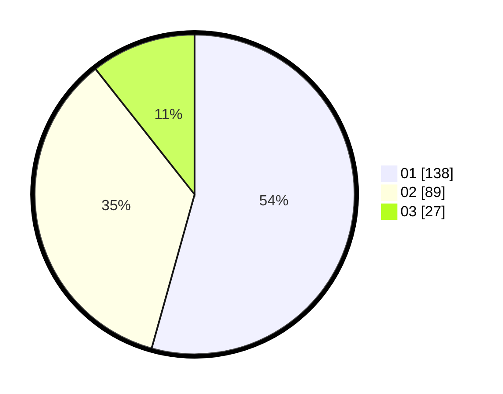

# Hasil

Hasil perolehan suara paslon dapat dilihat pada file paslon-01.txt, paslon-02.txt, dan paslon-03.txt.

Jika tidak ada, artinya data tersebut belum ada pada SIREKAP.

## Perolehan Suara

 * Paslon 01: **138**.
 * Paslon 02: **89**.
 * Paslon 03: **27**.

## Foto C Plano

https://sirekap-obj-formc.kpu.go.id/a87c/pemilu/ppwp/31/73/03/10/02/3173031002008-20240214-225912--944e2659-9db3-43f2-9991-645eb6b0205e.jpg

https://sirekap-obj-formc.kpu.go.id/a87c/pemilu/ppwp/31/73/03/10/02/3173031002008-20240215-011243--8165e622-aba6-4aa5-9d7a-24352ddb045e.jpg
