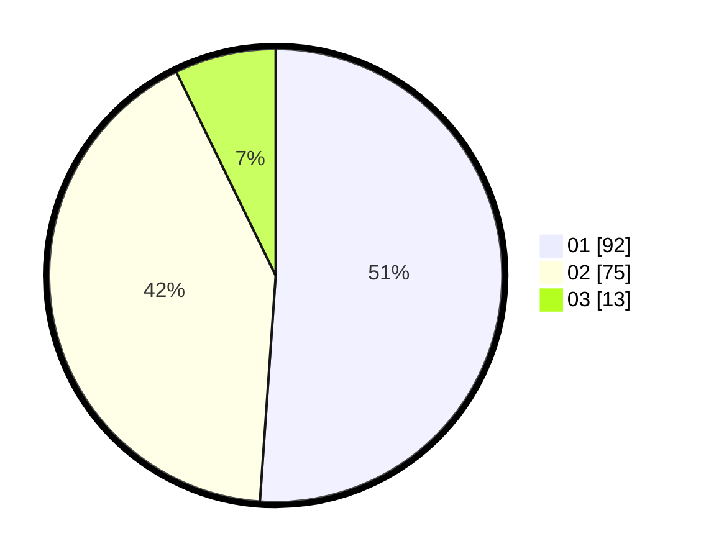

# Hasil

Hasil perolehan suara paslon dapat dilihat pada file paslon-01.txt, paslon-02.txt, dan paslon-03.txt.

Jika tidak ada, artinya data tersebut belum ada pada SIREKAP.

## Perolehan Suara

 * Paslon 01: **92**.
 * Paslon 02: **75**.
 * Paslon 03: **13**.

## Foto C Plano

https://sirekap-obj-formc.kpu.go.id/c4dc/pemilu/ppwp/31/73/03/10/02/3173031002009-20240216-212122--4b431a48-f848-4c26-a001-ad2ec5b95a33.jpg

https://sirekap-obj-formc.kpu.go.id/c4dc/pemilu/ppwp/31/73/03/10/02/3173031002009-20240216-212123--cc7bff0a-fb5e-4431-bbc4-7996b9c06cd7.jpg

https://sirekap-obj-formc.kpu.go.id/c4dc/pemilu/ppwp/31/73/03/10/02/3173031002009-20240216-212123--32568692-9a46-4d9d-be96-44dfdc5a94a0.jpg

## DATA PEMILIH TETAP

Jumlah pemilih dalam DPT: **246**.
 * L: **116**.
 * P: **130**.

## DATA PENGGUNA HAK PILIH

Jumlah pengguna hak pilih dalam DPT: **179**.
 * L: **83**.
 * P: **96**.

Jumlah pengguna hak pilih dalam DPTb: **1**.
 * L: **0**.
 * P: **1**.

Jumlah pengguna hak pilih dalam DPK: **2**.
 * L: **1**.
 * P: **1**.

Jumlah pengguna hak pilih: **182**.
 * L: **84**.
 * P: **98**.

## JUMLAH SUARA SAH DAN TIDAK SAH

JUMLAH SELURUH SUARA SAH: **180**.

JUMLAH SUARA TIDAK SAH: **2**.

JUMLAH SELURUH SUARA SAH DAN SUARA TIDAK SAH: **182**.
