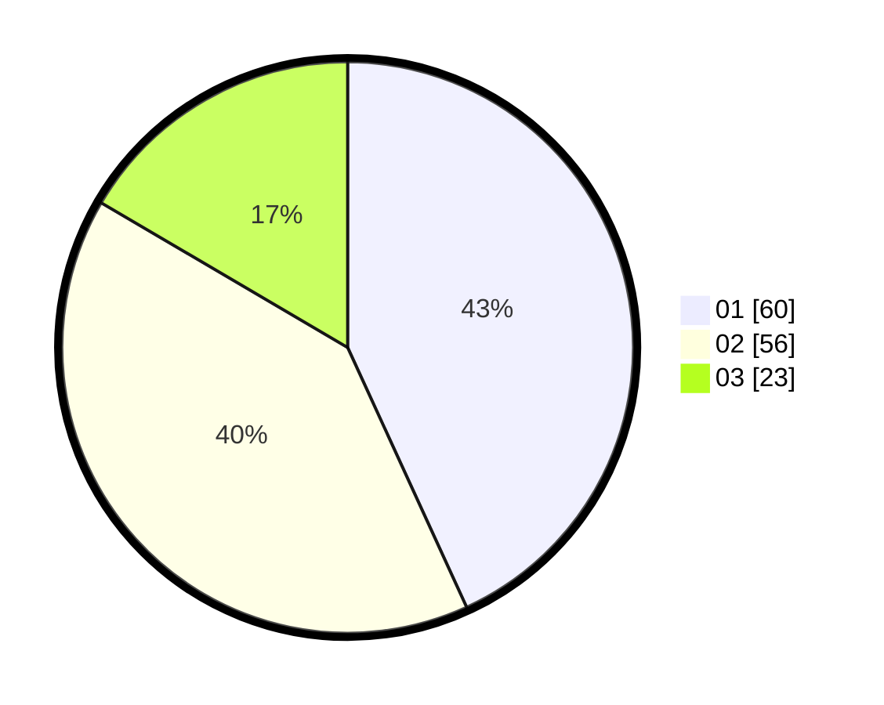

# Hasil

Hasil perolehan suara paslon dapat dilihat pada file paslon-01.txt, paslon-02.txt, dan paslon-03.txt.

Jika tidak ada, artinya data tersebut belum ada pada SIREKAP.

## Perolehan Suara

 * Paslon 01: **60**.
 * Paslon 02: **56**.
 * Paslon 03: **23**.

## Foto C Plano

https://sirekap-obj-formc.kpu.go.id/52be/pemilu/ppwp/31/73/03/10/02/3173031002013-20240215-213258--d705f966-a588-4b80-92b1-3785637b4d04.jpg

https://sirekap-obj-formc.kpu.go.id/52be/pemilu/ppwp/31/73/03/10/02/3173031002013-20240215-213301--6db370c4-21ba-4210-8c7c-2958ea2788fd.jpg

https://sirekap-obj-formc.kpu.go.id/52be/pemilu/ppwp/31/73/03/10/02/3173031002013-20240215-213300--4bc9acca-29bf-4773-ab14-dcedb7c4a483.jpg

## DATA PEMILIH TETAP

Jumlah pemilih dalam DPT: **188**.
 * L: **100**.
 * P: **88**.

## DATA PENGGUNA HAK PILIH

Jumlah pengguna hak pilih dalam DPT: **140**.
 * L: **68**.
 * P: **72**.

Jumlah pengguna hak pilih dalam DPTb: **3**.
 * L: **2**.
 * P: **1**.

Jumlah pengguna hak pilih dalam DPK: **1**.
 * L: **1**.
 * P: **0**.

Jumlah pengguna hak pilih: **144**.
 * L: **71**.
 * P: **73**.

## JUMLAH SUARA SAH DAN TIDAK SAH

JUMLAH SELURUH SUARA SAH: **139**.

JUMLAH SUARA TIDAK SAH: **5**.

JUMLAH SELURUH SUARA SAH DAN SUARA TIDAK SAH: **144**.
