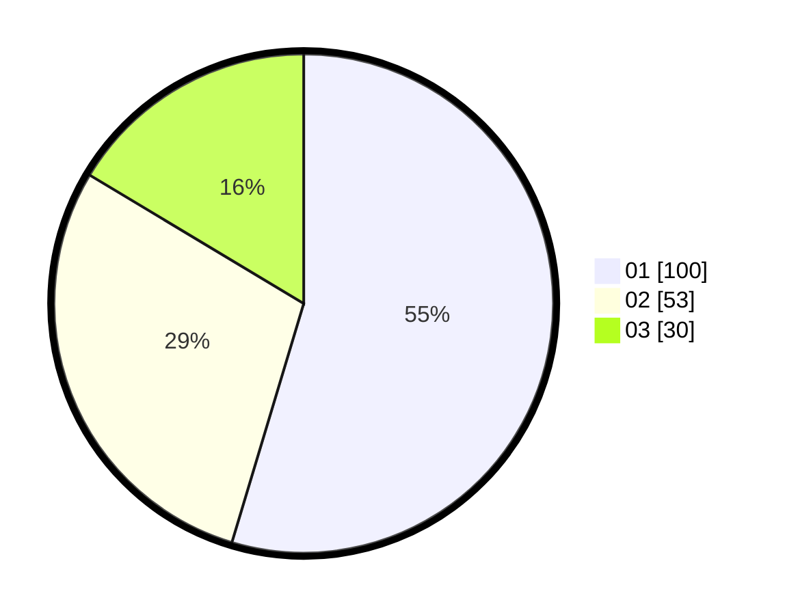

# Hasil

Hasil perolehan suara paslon dapat dilihat pada file paslon-01.txt, paslon-02.txt, dan paslon-03.txt.

Jika tidak ada, artinya data tersebut belum ada pada SIREKAP.

## Perolehan Suara

 * Paslon 01: **100**.
 * Paslon 02: **53**.
 * Paslon 03: **30**.

## Foto C Plano

https://sirekap-obj-formc.kpu.go.id/7a06/pemilu/ppwp/31/73/03/10/02/3173031002018-20240214-234204--f2b26815-2e81-42b8-a6e7-9335351697b4.jpg

https://sirekap-obj-formc.kpu.go.id/7a06/pemilu/ppwp/31/73/03/10/02/3173031002018-20240214-234324--f6091843-e046-4f19-bd8d-1663efb0150d.jpg

https://sirekap-obj-formc.kpu.go.id/7a06/pemilu/ppwp/31/73/03/10/02/3173031002018-20240214-234430--7e9ade06-2f47-40e8-b817-6a224d7de8f0.jpg
