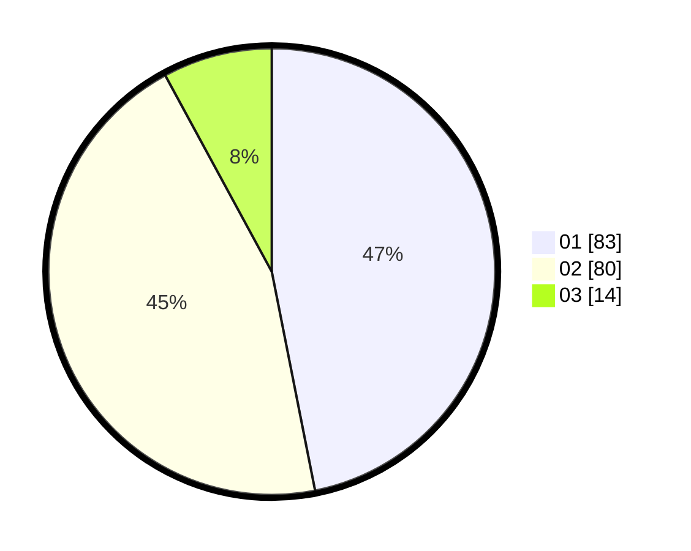

# Hasil

Hasil perolehan suara paslon dapat dilihat pada file paslon-01.txt, paslon-02.txt, dan paslon-03.txt.

Jika tidak ada, artinya data tersebut belum ada pada SIREKAP.

## Perolehan Suara

 * Paslon 01: **83**.
 * Paslon 02: **80**.
 * Paslon 03: **14**.

## Foto C Plano

https://sirekap-obj-formc.kpu.go.id/9f2f/pemilu/ppwp/31/73/03/10/02/3173031002021-20240214-155734--ed15c2e1-4729-488f-bbb6-8bd41aa94b8a.jpg

https://sirekap-obj-formc.kpu.go.id/9f2f/pemilu/ppwp/31/73/03/10/02/3173031002021-20240214-155808--d2899b09-7a10-401b-adda-20d22ce681d1.jpg

https://sirekap-obj-formc.kpu.go.id/9f2f/pemilu/ppwp/31/73/03/10/02/3173031002021-20240214-160102--d0d0c8e0-8bcf-4bec-81f6-ea3902ce84b5.jpg
