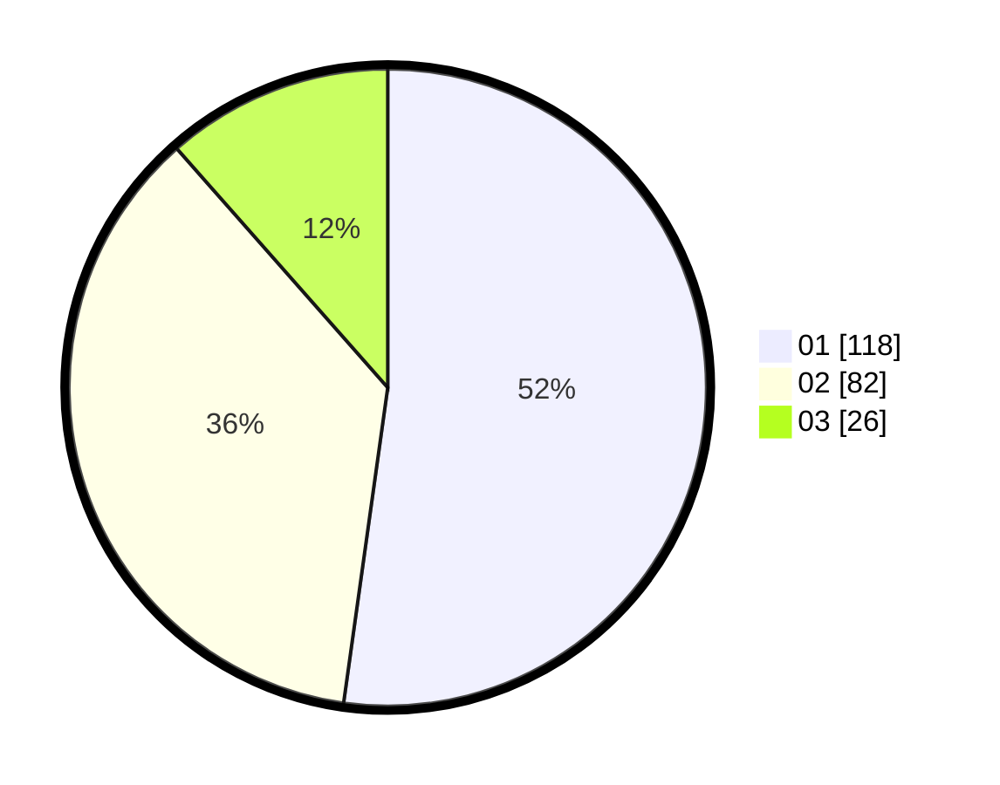

# Hasil

Hasil perolehan suara paslon dapat dilihat pada file paslon-01.txt, paslon-02.txt, dan paslon-03.txt.

Jika tidak ada, artinya data tersebut belum ada pada SIREKAP.

## Perolehan Suara

 * Paslon 01: **118**.
 * Paslon 02: **82**.
 * Paslon 03: **26**.

## Foto C Plano

https://sirekap-obj-formc.kpu.go.id/5ab7/pemilu/ppwp/31/73/03/10/02/3173031002024-20240214-181324--d68340b4-901c-46af-b786-5a5ece3161bd.jpg

https://sirekap-obj-formc.kpu.go.id/5ab7/pemilu/ppwp/31/73/03/10/02/3173031002024-20240214-185447--c0272337-9bfe-4f61-8db1-ddb8e847e4e7.jpg
