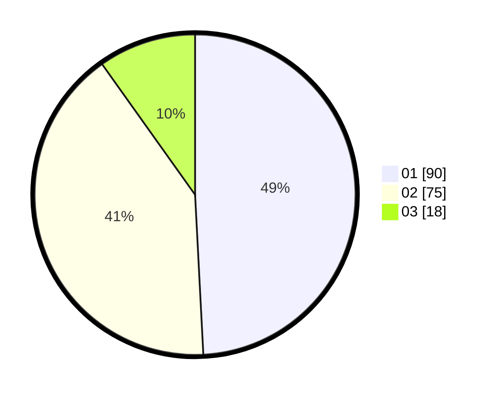

# Hasil

Hasil perolehan suara paslon dapat dilihat pada file paslon-01.txt, paslon-02.txt, dan paslon-03.txt.

Jika tidak ada, artinya data tersebut belum ada pada SIREKAP.

## Perolehan Suara

 * Paslon 01: **90**.
 * Paslon 02: **75**.
 * Paslon 03: **18**.

## Foto C Plano

https://sirekap-obj-formc.kpu.go.id/418d/pemilu/ppwp/31/73/03/10/02/3173031002025-20240214-230604--2f584985-0deb-4377-b44a-40f1b1d76185.jpg

https://sirekap-obj-formc.kpu.go.id/418d/pemilu/ppwp/31/73/03/10/02/3173031002025-20240214-230729--cd38dcd9-0c4c-4a2d-b862-2fe6e033ffd8.jpg

https://sirekap-obj-formc.kpu.go.id/418d/pemilu/ppwp/31/73/03/10/02/3173031002025-20240214-230945--9992a150-6047-4d0f-beb1-30114806c2e4.jpg
