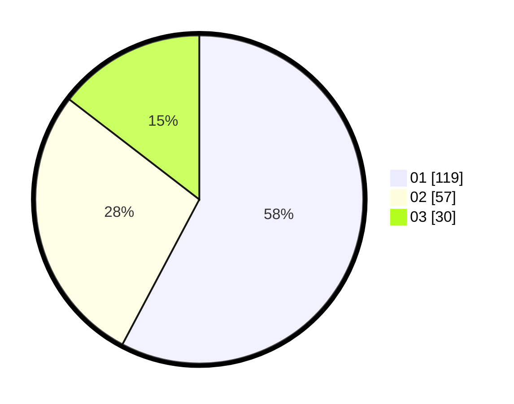

# Hasil

Hasil perolehan suara paslon dapat dilihat pada file paslon-01.txt, paslon-02.txt, dan paslon-03.txt.

Jika tidak ada, artinya data tersebut belum ada pada SIREKAP.

## Perolehan Suara

 * Paslon 01: **119**.
 * Paslon 02: **57**.
 * Paslon 03: **30**.

## Foto C Plano

https://sirekap-obj-formc.kpu.go.id/998c/pemilu/ppwp/31/73/03/10/02/3173031002031-20240215-043726--e1ea810d-56fb-4b2a-9a3e-3c5fd076b3be.jpg

https://sirekap-obj-formc.kpu.go.id/998c/pemilu/ppwp/31/73/03/10/02/3173031002031-20240214-155655--53bed5e4-ffe2-4dc8-ac96-723fc65b0af4.jpg

https://sirekap-obj-formc.kpu.go.id/998c/pemilu/ppwp/31/73/03/10/02/3173031002031-20240214-155728--a4404cb9-1909-4930-ad1b-b6250e932985.jpg

## DATA PEMILIH TETAP

Jumlah pemilih dalam DPT: **267**.
 * L: **119**.
 * P: **148**.

## DATA PENGGUNA HAK PILIH

Jumlah pengguna hak pilih dalam DPT: **205**.
 * L: **88**.
 * P: **117**.

Jumlah pengguna hak pilih dalam DPTb: **3**.
 * L: **0**.
 * P: **3**.

Jumlah pengguna hak pilih dalam DPK: **0**.
 * L: **0**.
 * P: **0**.

Jumlah pengguna hak pilih: **208**.
 * L: **88**.
 * P: **120**.

## JUMLAH SUARA SAH DAN TIDAK SAH

JUMLAH SELURUH SUARA SAH: **206**.

JUMLAH SUARA TIDAK SAH: **2**.

JUMLAH SELURUH SUARA SAH DAN SUARA TIDAK SAH: **208**.
