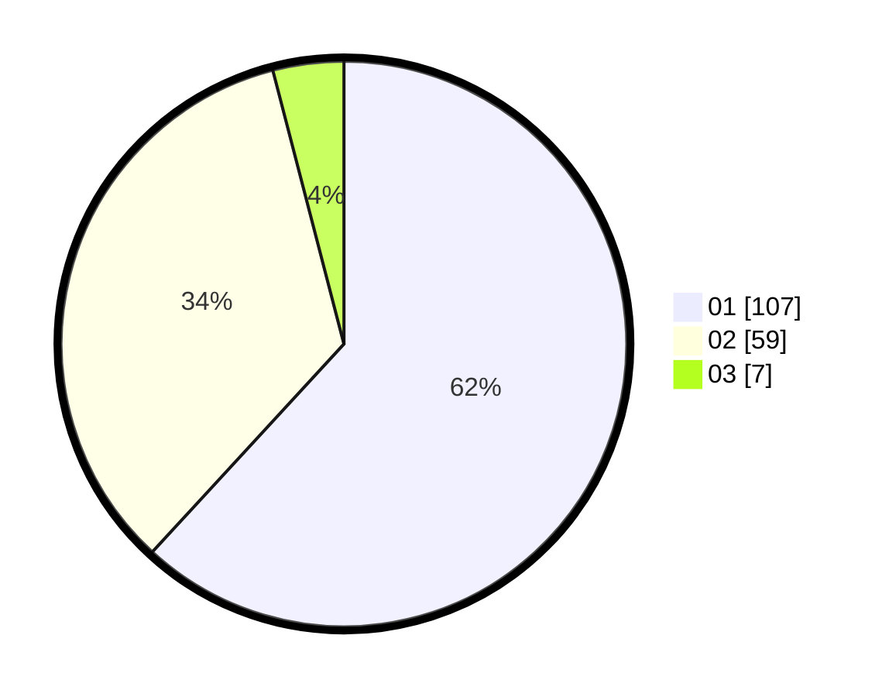

# Hasil

Hasil perolehan suara paslon dapat dilihat pada file paslon-01.txt, paslon-02.txt, dan paslon-03.txt.

Jika tidak ada, artinya data tersebut belum ada pada SIREKAP.

## Perolehan Suara

 * Paslon 01: **107**.
 * Paslon 02: **59**.
 * Paslon 03: **7**.

## Foto C Plano

https://sirekap-obj-formc.kpu.go.id/742d/pemilu/ppwp/31/73/03/10/02/3173031002033-20240214-191228--1d34bbac-06ec-425e-86db-0b363fc28d2d.jpg

https://sirekap-obj-formc.kpu.go.id/742d/pemilu/ppwp/31/73/03/10/02/3173031002033-20240214-194155--e8a60d11-5654-4a1f-86f7-069f6a9abb46.jpg

https://sirekap-obj-formc.kpu.go.id/742d/pemilu/ppwp/31/73/03/10/02/3173031002033-20240214-194303--52756cd5-7d51-4ac4-b768-4030165fa129.jpg

## DATA PEMILIH TETAP

Jumlah pemilih dalam DPT: **262**.
 * L: **134**.
 * P: **128**.

## DATA PENGGUNA HAK PILIH

Jumlah pengguna hak pilih dalam DPT: **170**.
 * L: **83**.
 * P: **87**.

Jumlah pengguna hak pilih dalam DPTb: **3**.
 * L: **2**.
 * P: **1**.

Jumlah pengguna hak pilih dalam DPK: **0**.
 * L: **0**.
 * P: **0**.

Jumlah pengguna hak pilih: **173**.
 * L: **85**.
 * P: **88**.

## JUMLAH SUARA SAH DAN TIDAK SAH

JUMLAH SELURUH SUARA SAH: **173**.

JUMLAH SUARA TIDAK SAH: **0**.

JUMLAH SELURUH SUARA SAH DAN SUARA TIDAK SAH: **173**.
