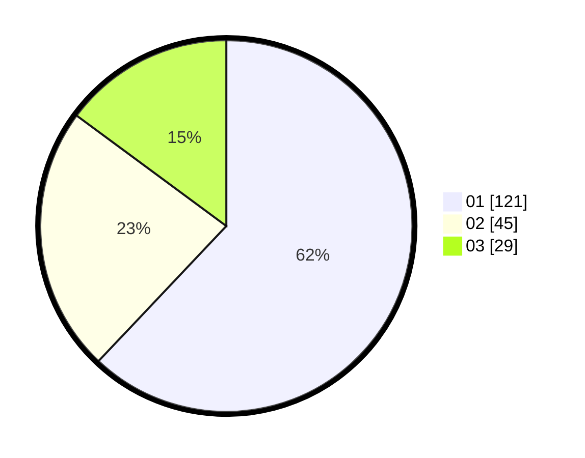

# Hasil

Hasil perolehan suara paslon dapat dilihat pada file paslon-01.txt, paslon-02.txt, dan paslon-03.txt.

Jika tidak ada, artinya data tersebut belum ada pada SIREKAP.

## Perolehan Suara

 * Paslon 01: **121**.
 * Paslon 02: **45**.
 * Paslon 03: **29**.

## Foto C Plano

https://sirekap-obj-formc.kpu.go.id/c83f/pemilu/ppwp/31/73/03/10/02/3173031002034-20240214-225947--1ac35e52-bcaf-4ee2-b049-14331c02cc72.jpg

https://sirekap-obj-formc.kpu.go.id/c83f/pemilu/ppwp/31/73/03/10/02/3173031002034-20240214-230636--2379af4e-55ad-49f0-bbe5-39f7ba531b74.jpg

https://sirekap-obj-formc.kpu.go.id/c83f/pemilu/ppwp/31/73/03/10/02/3173031002034-20240214-232631--60e9a63d-0525-40e0-88b4-c69f158cd08a.jpg
