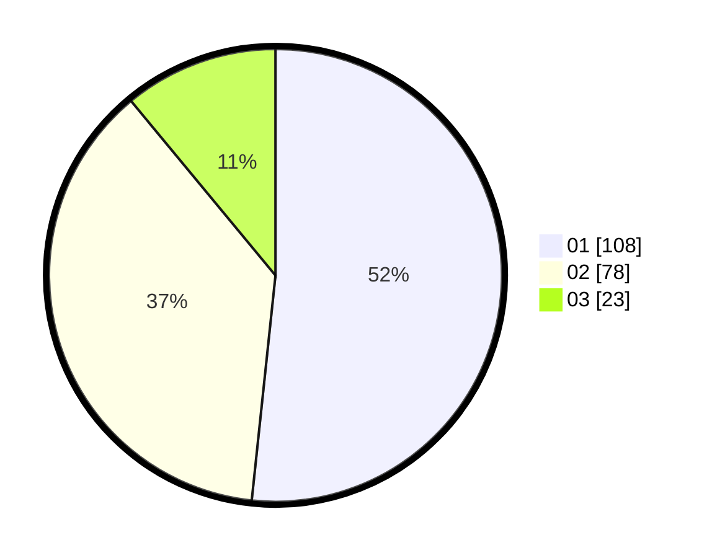

# Hasil

Hasil perolehan suara paslon dapat dilihat pada file paslon-01.txt, paslon-02.txt, dan paslon-03.txt.

Jika tidak ada, artinya data tersebut belum ada pada SIREKAP.

## Perolehan Suara

 * Paslon 01: **108**.
 * Paslon 02: **78**.
 * Paslon 03: **23**.

## Foto C Plano

https://sirekap-obj-formc.kpu.go.id/38c5/pemilu/ppwp/31/73/03/10/02/3173031002043-20240215-000145--4f6f54e1-1eca-45fa-8417-bf9d38e033e4.jpg

https://sirekap-obj-formc.kpu.go.id/38c5/pemilu/ppwp/31/73/03/10/02/3173031002043-20240215-043607--fb70072b-7a28-47bc-9df4-bda1be881862.jpg

https://sirekap-obj-formc.kpu.go.id/38c5/pemilu/ppwp/31/73/03/10/02/3173031002043-20240215-000216--e4f50236-4775-4f2d-9538-0de697fd385d.jpg
