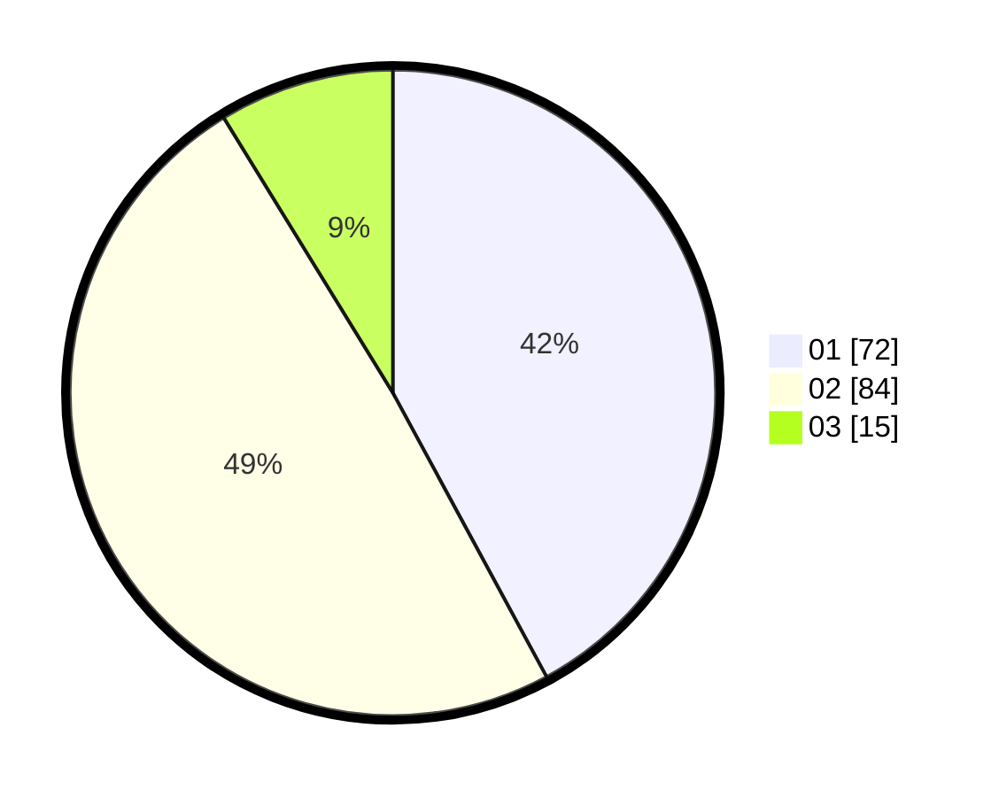

# Hasil

Hasil perolehan suara paslon dapat dilihat pada file paslon-01.txt, paslon-02.txt, dan paslon-03.txt.

Jika tidak ada, artinya data tersebut belum ada pada SIREKAP.

## Perolehan Suara

 * Paslon 01: **72**.
 * Paslon 02: **84**.
 * Paslon 03: **15**.

## Foto C Plano

https://sirekap-obj-formc.kpu.go.id/cae5/pemilu/ppwp/31/73/03/10/02/3173031002045-20240214-185625--2b827657-7c2b-4a55-8d7f-d33b5cc5dccd.jpg

https://sirekap-obj-formc.kpu.go.id/cae5/pemilu/ppwp/31/73/03/10/02/3173031002045-20240214-190100--40cb28df-45db-4205-9f71-f887bcac6012.jpg

https://sirekap-obj-formc.kpu.go.id/cae5/pemilu/ppwp/31/73/03/10/02/3173031002045-20240214-190204--295180ec-1c22-46ff-b791-23948bd05e8a.jpg

## DATA PEMILIH TETAP

Jumlah pemilih dalam DPT: **208**.
 * L: **99**.
 * P: **109**.

## DATA PENGGUNA HAK PILIH

Jumlah pengguna hak pilih dalam DPT: **164**.
 * L: **78**.
 * P: **86**.

Jumlah pengguna hak pilih dalam DPTb: **4**.
 * L: **2**.
 * P: **2**.

Jumlah pengguna hak pilih dalam DPK: **4**.
 * L: **2**.
 * P: **2**.

Jumlah pengguna hak pilih: **172**.
 * L: **82**.
 * P: **90**.

## JUMLAH SUARA SAH DAN TIDAK SAH

JUMLAH SELURUH SUARA SAH: **171**.

JUMLAH SUARA TIDAK SAH: **1**.

JUMLAH SELURUH SUARA SAH DAN SUARA TIDAK SAH: **172**.
