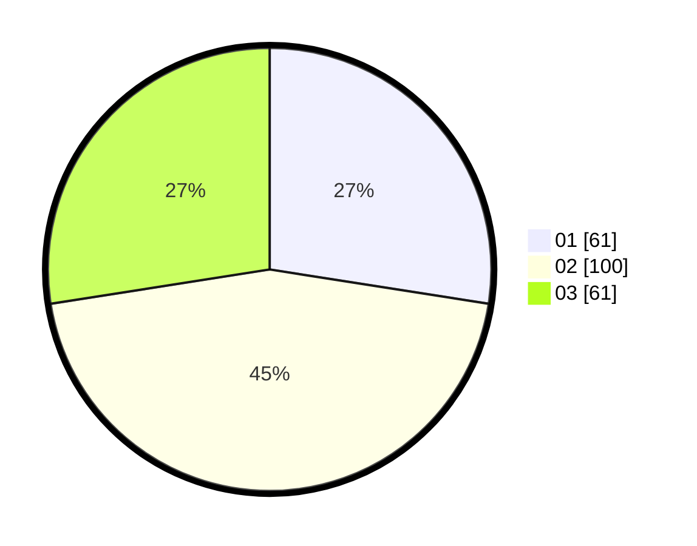

# Hasil

Hasil perolehan suara paslon dapat dilihat pada file paslon-01.txt, paslon-02.txt, dan paslon-03.txt.

Jika tidak ada, artinya data tersebut belum ada pada SIREKAP.

## Perolehan Suara

 * Paslon 01: **61**.
 * Paslon 02: **100**.
 * Paslon 03: **61**.

## Foto C Plano

https://sirekap-obj-formc.kpu.go.id/e8b9/pemilu/ppwp/31/73/03/10/02/3173031002050-20240216-033212--e0896f9d-7ecb-4fe8-a677-71f4b9485b14.jpg

https://sirekap-obj-formc.kpu.go.id/e8b9/pemilu/ppwp/31/73/03/10/02/3173031002050-20240216-032229--c0eeae6a-31ea-41ab-bb50-cdc2a22bb25b.jpg

https://sirekap-obj-formc.kpu.go.id/e8b9/pemilu/ppwp/31/73/03/10/02/3173031002050-20240216-032228--2221120d-166e-4708-99f8-0363f95c382e.jpg

## DATA PEMILIH TETAP

Jumlah pemilih dalam DPT: **277**.
 * L: **138**.
 * P: **139**.

## DATA PENGGUNA HAK PILIH

Jumlah pengguna hak pilih dalam DPT: **219**.
 * L: **104**.
 * P: **115**.

Jumlah pengguna hak pilih dalam DPTb: **6**.
 * L: **3**.
 * P: **3**.

Jumlah pengguna hak pilih dalam DPK: **5**.
 * L: **3**.
 * P: **2**.

Jumlah pengguna hak pilih: **227**.
 * L: **110**.
 * P: **117**.

## JUMLAH SUARA SAH DAN TIDAK SAH

JUMLAH SELURUH SUARA SAH: **222**.

JUMLAH SUARA TIDAK SAH: **5**.

JUMLAH SELURUH SUARA SAH DAN SUARA TIDAK SAH: **227**.
