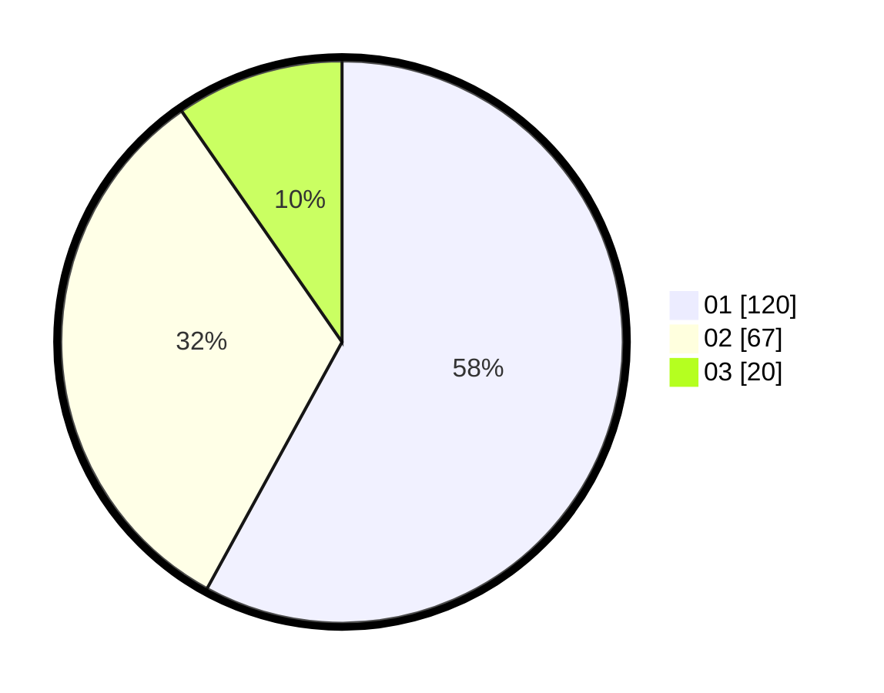

# Hasil

Hasil perolehan suara paslon dapat dilihat pada file paslon-01.txt, paslon-02.txt, dan paslon-03.txt.

Jika tidak ada, artinya data tersebut belum ada pada SIREKAP.

## Perolehan Suara

 * Paslon 01: **120**.
 * Paslon 02: **67**.
 * Paslon 03: **20**.

## Foto C Plano

https://sirekap-obj-formc.kpu.go.id/b99b/pemilu/ppwp/31/73/03/10/02/3173031002058-20240216-002607--3169609f-9704-4916-9684-9df2cb2f9e03.jpg

https://sirekap-obj-formc.kpu.go.id/b99b/pemilu/ppwp/31/73/03/10/02/3173031002058-20240216-002608--c154bc0f-4e7b-4a23-aae0-1057cc45ce66.jpg

https://sirekap-obj-formc.kpu.go.id/b99b/pemilu/ppwp/31/73/03/10/02/3173031002058-20240216-002608--073ea8d2-d193-4929-b620-ce51078e7bf8.jpg

## DATA PEMILIH TETAP

Jumlah pemilih dalam DPT: **286**.
 * L: **142**.
 * P: **144**.

## DATA PENGGUNA HAK PILIH

Jumlah pengguna hak pilih dalam DPT: **210**.
 * L: **107**.
 * P: **103**.

Jumlah pengguna hak pilih dalam DPTb: **3**.
 * L: **0**.
 * P: **3**.

Jumlah pengguna hak pilih dalam DPK: **0**.
 * L: **0**.
 * P: **0**.

Jumlah pengguna hak pilih: **213**.
 * L: **107**.
 * P: **106**.

## JUMLAH SUARA SAH DAN TIDAK SAH

JUMLAH SELURUH SUARA SAH: **207**.

JUMLAH SUARA TIDAK SAH: **6**.

JUMLAH SELURUH SUARA SAH DAN SUARA TIDAK SAH: **213**.
