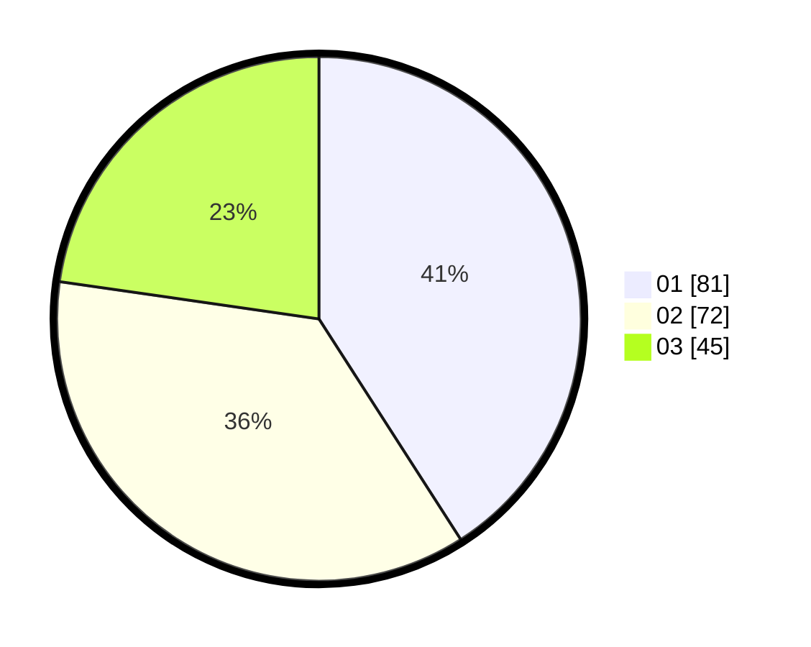

# Hasil

Hasil perolehan suara paslon dapat dilihat pada file paslon-01.txt, paslon-02.txt, dan paslon-03.txt.

Jika tidak ada, artinya data tersebut belum ada pada SIREKAP.

## Perolehan Suara

 * Paslon 01: **81**.
 * Paslon 02: **72**.
 * Paslon 03: **45**.

## Foto C Plano

https://sirekap-obj-formc.kpu.go.id/afc7/pemilu/ppwp/31/73/03/10/02/3173031002060-20240215-041511--32d5da64-89c1-4292-8543-b90b62fdcd54.jpg

https://sirekap-obj-formc.kpu.go.id/afc7/pemilu/ppwp/31/73/03/10/02/3173031002060-20240215-041534--1137ee1d-439f-4d4d-9436-96770a1afc02.jpg

https://sirekap-obj-formc.kpu.go.id/afc7/pemilu/ppwp/31/73/03/10/02/3173031002060-20240215-041523--d004958c-27a1-4aeb-ab5f-0369ac2e719f.jpg

## DATA PEMILIH TETAP

Jumlah pemilih dalam DPT: **281**.
 * L: **133**.
 * P: **148**.

## DATA PENGGUNA HAK PILIH

Jumlah pengguna hak pilih dalam DPT: **195**.
 * L: **89**.
 * P: **106**.

Jumlah pengguna hak pilih dalam DPTb: **3**.
 * L: **0**.
 * P: **3**.

Jumlah pengguna hak pilih dalam DPK: **3**.
 * L: **2**.
 * P: **1**.

Jumlah pengguna hak pilih: **201**.
 * L: **91**.
 * P: **110**.

## JUMLAH SUARA SAH DAN TIDAK SAH

JUMLAH SELURUH SUARA SAH: **198**.

JUMLAH SUARA TIDAK SAH: **3**.

JUMLAH SELURUH SUARA SAH DAN SUARA TIDAK SAH: **201**.
