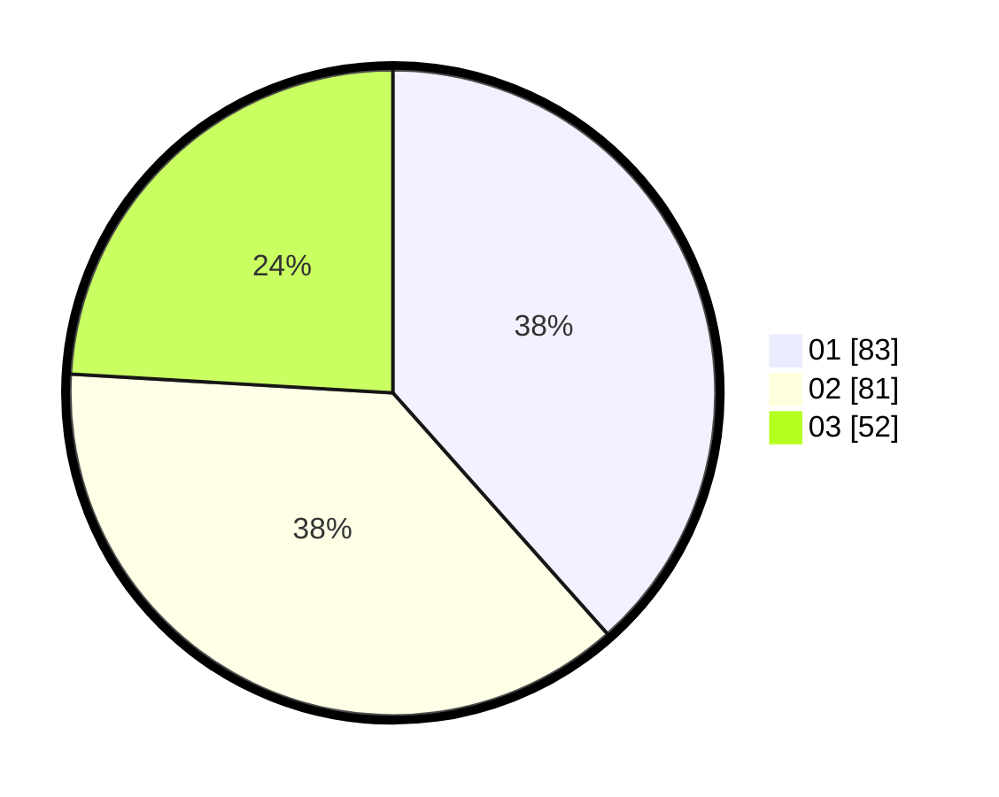

# Hasil

Hasil perolehan suara paslon dapat dilihat pada file paslon-01.txt, paslon-02.txt, dan paslon-03.txt.

Jika tidak ada, artinya data tersebut belum ada pada SIREKAP.

## Perolehan Suara

 * Paslon 01: **83**.
 * Paslon 02: **81**.
 * Paslon 03: **52**.

## Foto C Plano

https://sirekap-obj-formc.kpu.go.id/bd1c/pemilu/ppwp/31/73/03/10/02/3173031002061-20240215-202823--15e98031-2413-4647-b8bc-bf2164926aba.jpg

https://sirekap-obj-formc.kpu.go.id/bd1c/pemilu/ppwp/31/73/03/10/02/3173031002061-20240216-014208--4a16e9ce-18f8-48b4-9a23-5e920623572b.jpg

https://sirekap-obj-formc.kpu.go.id/bd1c/pemilu/ppwp/31/73/03/10/02/3173031002061-20240215-202833--2a48bb49-6da1-4e74-9d30-edcbbd86c4dd.jpg

## DATA PEMILIH TETAP

Jumlah pemilih dalam DPT: **278**.
 * L: **133**.
 * P: **145**.

## DATA PENGGUNA HAK PILIH

Jumlah pengguna hak pilih dalam DPT: **212**.
 * L: **96**.
 * P: **116**.

Jumlah pengguna hak pilih dalam DPTb: **4**.
 * L: **1**.
 * P: **3**.

Jumlah pengguna hak pilih dalam DPK: **0**.
 * L: **0**.
 * P: **0**.

Jumlah pengguna hak pilih: **216**.
 * L: **97**.
 * P: **119**.

## JUMLAH SUARA SAH DAN TIDAK SAH

JUMLAH SELURUH SUARA SAH: **216**.

JUMLAH SUARA TIDAK SAH: **0**.

JUMLAH SELURUH SUARA SAH DAN SUARA TIDAK SAH: **216**.
