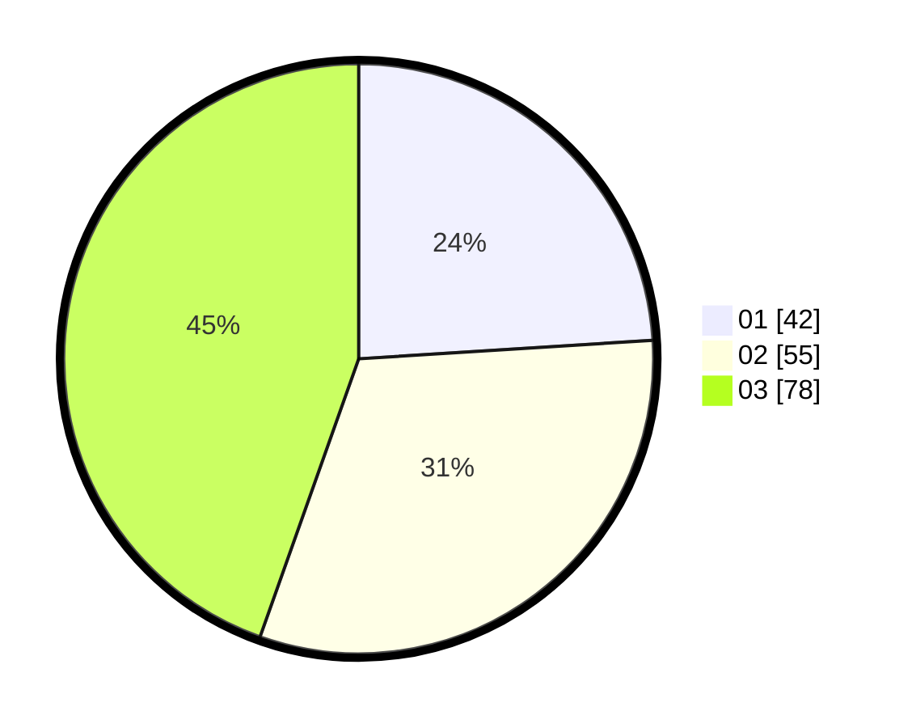

# Hasil

Hasil perolehan suara paslon dapat dilihat pada file paslon-01.txt, paslon-02.txt, dan paslon-03.txt.

Jika tidak ada, artinya data tersebut belum ada pada SIREKAP.

## Perolehan Suara

 * Paslon 01: **42**.
 * Paslon 02: **55**.
 * Paslon 03: **78**.

## Foto C Plano

https://sirekap-obj-formc.kpu.go.id/b9ab/pemilu/ppwp/31/73/03/10/02/3173031002067-20240215-100346--ac214c51-6536-44ff-9218-f59e2fbea5bd.jpg

https://sirekap-obj-formc.kpu.go.id/b9ab/pemilu/ppwp/31/73/03/10/02/3173031002067-20240215-100410--a2cbdd32-2331-4791-b3d5-a5edb8dbea3e.jpg

https://sirekap-obj-formc.kpu.go.id/b9ab/pemilu/ppwp/31/73/03/10/02/3173031002067-20240215-100359--ba2f9dbd-e52e-4869-bf78-194a927300af.jpg

## DATA PEMILIH TETAP

Jumlah pemilih dalam DPT: **221**.
 * L: **103**.
 * P: **118**.

## DATA PENGGUNA HAK PILIH

Jumlah pengguna hak pilih dalam DPT: **169**.
 * L: **77**.
 * P: **92**.

Jumlah pengguna hak pilih dalam DPTb: **4**.
 * L: **1**.
 * P: **3**.

Jumlah pengguna hak pilih dalam DPK: **2**.
 * L: **1**.
 * P: **1**.

Jumlah pengguna hak pilih: **175**.
 * L: **79**.
 * P: **96**.

## JUMLAH SUARA SAH DAN TIDAK SAH

JUMLAH SELURUH SUARA SAH: **175**.

JUMLAH SUARA TIDAK SAH: **0**.

JUMLAH SELURUH SUARA SAH DAN SUARA TIDAK SAH: **175**.
