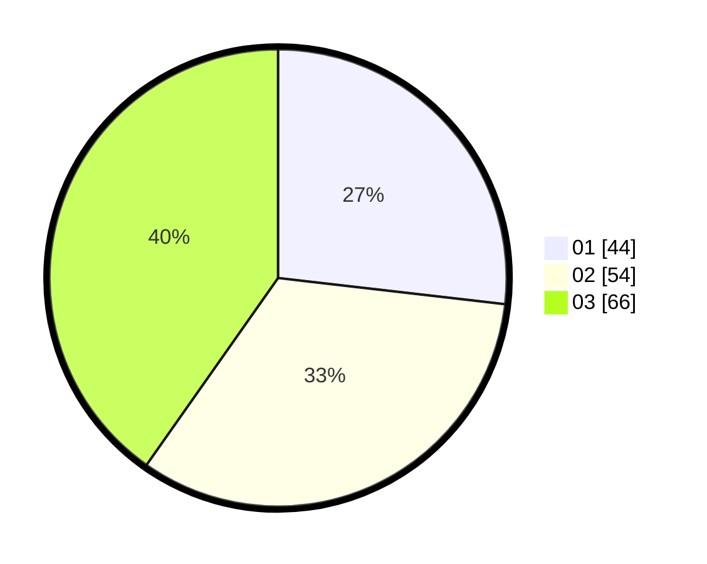

# Hasil

Hasil perolehan suara paslon dapat dilihat pada file paslon-01.txt, paslon-02.txt, dan paslon-03.txt.

Jika tidak ada, artinya data tersebut belum ada pada SIREKAP.

## Perolehan Suara

 * Paslon 01: **44**.
 * Paslon 02: **54**.
 * Paslon 03: **66**.

## Foto C Plano

https://sirekap-obj-formc.kpu.go.id/b9eb/pemilu/ppwp/31/73/03/10/02/3173031002068-20240214-204923--03eb31a7-6635-4297-a15c-313f4768f821.jpg

https://sirekap-obj-formc.kpu.go.id/b9eb/pemilu/ppwp/31/73/03/10/02/3173031002068-20240214-195341--ed9fe605-ebd8-428d-a10a-cc05577678e5.jpg

https://sirekap-obj-formc.kpu.go.id/b9eb/pemilu/ppwp/31/73/03/10/02/3173031002068-20240215-211648--daa1460e-e12a-4882-8bc1-477f8d639639.jpg

## DATA PEMILIH TETAP

Jumlah pemilih dalam DPT: **224**.
 * L: **108**.
 * P: **116**.

## DATA PENGGUNA HAK PILIH

Jumlah pengguna hak pilih dalam DPT: **162**.
 * L: **80**.
 * P: **82**.

Jumlah pengguna hak pilih dalam DPTb: **5**.
 * L: **1**.
 * P: **4**.

Jumlah pengguna hak pilih dalam DPK: **0**.
 * L: **0**.
 * P: **0**.

Jumlah pengguna hak pilih: **167**.
 * L: **81**.
 * P: **86**.

## JUMLAH SUARA SAH DAN TIDAK SAH

JUMLAH SELURUH SUARA SAH: **164**.

JUMLAH SUARA TIDAK SAH: **3**.

JUMLAH SELURUH SUARA SAH DAN SUARA TIDAK SAH: **167**.
