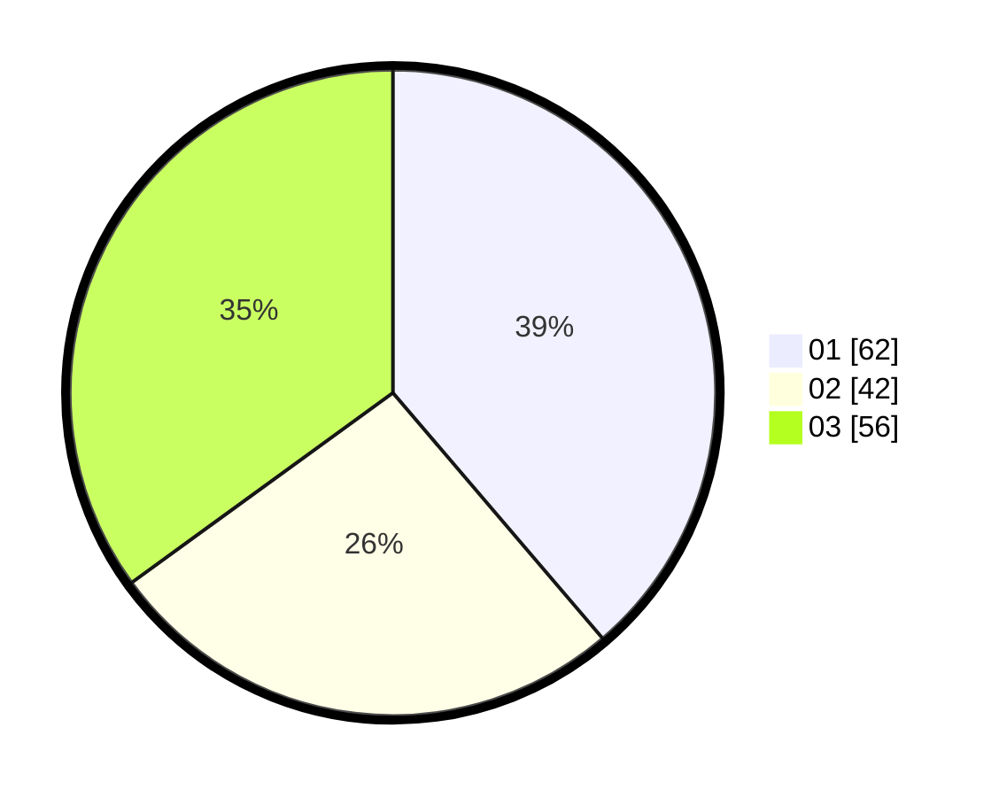

# Hasil

Hasil perolehan suara paslon dapat dilihat pada file paslon-01.txt, paslon-02.txt, dan paslon-03.txt.

Jika tidak ada, artinya data tersebut belum ada pada SIREKAP.

## Perolehan Suara

 * Paslon 01: **62**.
 * Paslon 02: **42**.
 * Paslon 03: **56**.

## Foto C Plano

https://sirekap-obj-formc.kpu.go.id/b586/pemilu/ppwp/31/73/03/10/03/3173031003009-20240214-212432--ff7c164f-e2a0-4b6e-820c-f3ccacde4322.jpg

https://sirekap-obj-formc.kpu.go.id/b586/pemilu/ppwp/31/73/03/10/03/3173031003009-20240214-212609--682dca2c-95f3-4809-b4a2-95afb838c027.jpg

https://sirekap-obj-formc.kpu.go.id/b586/pemilu/ppwp/31/73/03/10/03/3173031003009-20240214-213054--91ecc052-ba93-4da4-8300-1376e00b51bf.jpg
