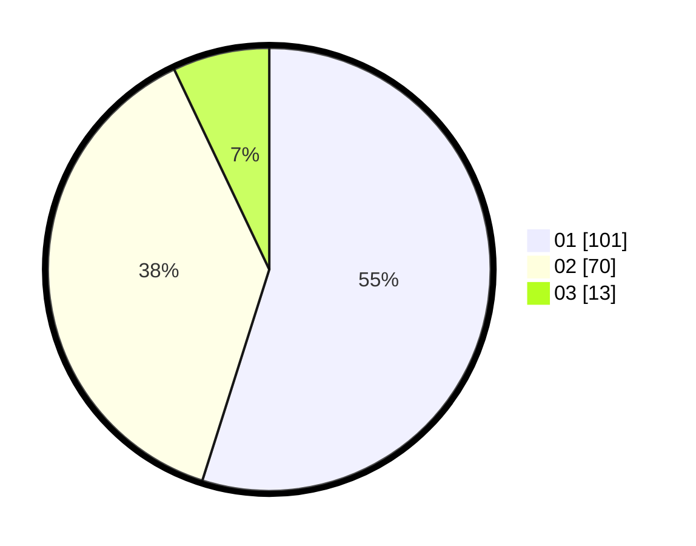

# Hasil

Hasil perolehan suara paslon dapat dilihat pada file paslon-01.txt, paslon-02.txt, dan paslon-03.txt.

Jika tidak ada, artinya data tersebut belum ada pada SIREKAP.

## Perolehan Suara

 * Paslon 01: **101**.
 * Paslon 02: **70**.
 * Paslon 03: **13**.

## Foto C Plano

https://sirekap-obj-formc.kpu.go.id/4548/pemilu/ppwp/31/73/03/10/03/3173031003012-20240214-212829--e85f6f55-ce93-4438-9a1d-f4fad4e21a96.jpg

https://sirekap-obj-formc.kpu.go.id/4548/pemilu/ppwp/31/73/03/10/03/3173031003012-20240214-213241--a4813e4f-e18d-4074-9496-773152e34f22.jpg

https://sirekap-obj-formc.kpu.go.id/4548/pemilu/ppwp/31/73/03/10/03/3173031003012-20240214-213341--149832de-f3bc-4781-aeb5-b867a8ecdf02.jpg
