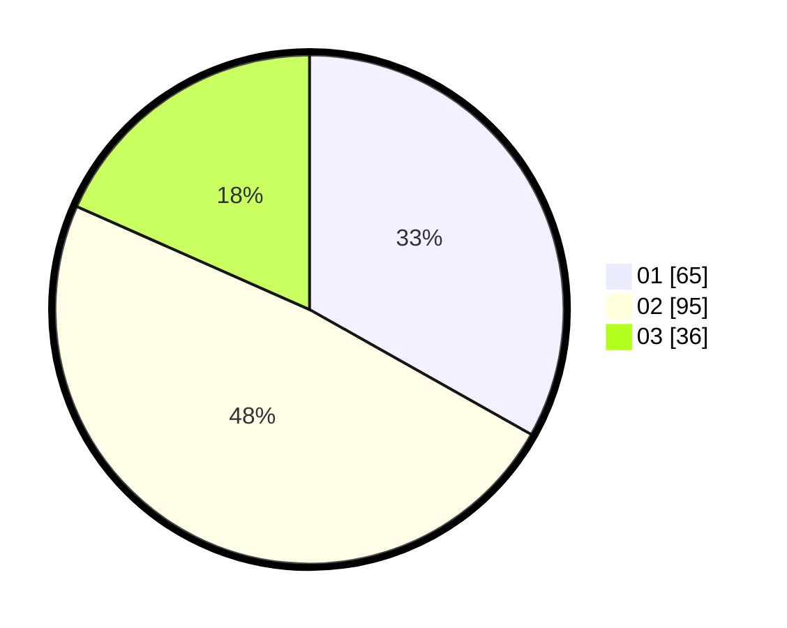

# Hasil

Hasil perolehan suara paslon dapat dilihat pada file paslon-01.txt, paslon-02.txt, dan paslon-03.txt.

Jika tidak ada, artinya data tersebut belum ada pada SIREKAP.

## Perolehan Suara

 * Paslon 01: **65**.
 * Paslon 02: **95**.
 * Paslon 03: **36**.

## Foto C Plano

https://sirekap-obj-formc.kpu.go.id/dc51/pemilu/ppwp/31/73/03/10/03/3173031003018-20240214-221127--cd3d74cd-b190-407d-a2ec-0c143c3a3241.jpg

https://sirekap-obj-formc.kpu.go.id/dc51/pemilu/ppwp/31/73/03/10/03/3173031003018-20240214-221228--5298e022-f29b-479c-bb25-c42e3d9464e8.jpg
