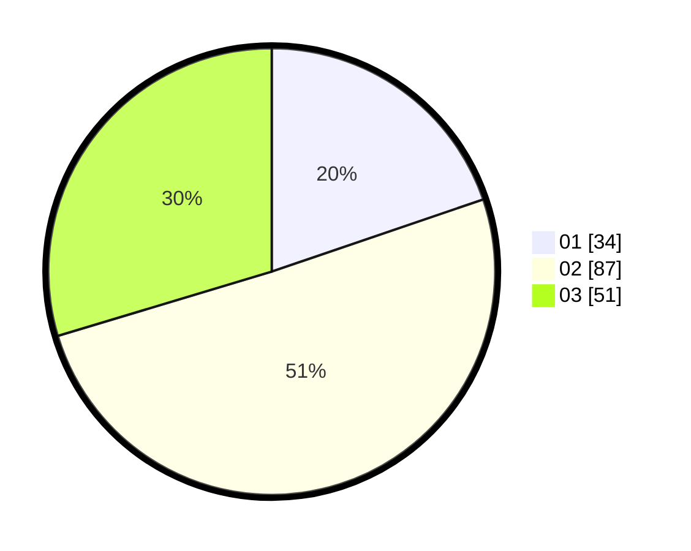

# Hasil

Hasil perolehan suara paslon dapat dilihat pada file paslon-01.txt, paslon-02.txt, dan paslon-03.txt.

Jika tidak ada, artinya data tersebut belum ada pada SIREKAP.

## Perolehan Suara

 * Paslon 01: **34**.
 * Paslon 02: **87**.
 * Paslon 03: **51**.

## Foto C Plano

https://sirekap-obj-formc.kpu.go.id/ac60/pemilu/ppwp/31/73/03/10/03/3173031003023-20240214-193128--0d457cc2-8195-4974-b956-73f31761038a.jpg

https://sirekap-obj-formc.kpu.go.id/ac60/pemilu/ppwp/31/73/03/10/03/3173031003023-20240214-193223--c1da2140-d343-4e19-a6b0-ba399c3fcf28.jpg
