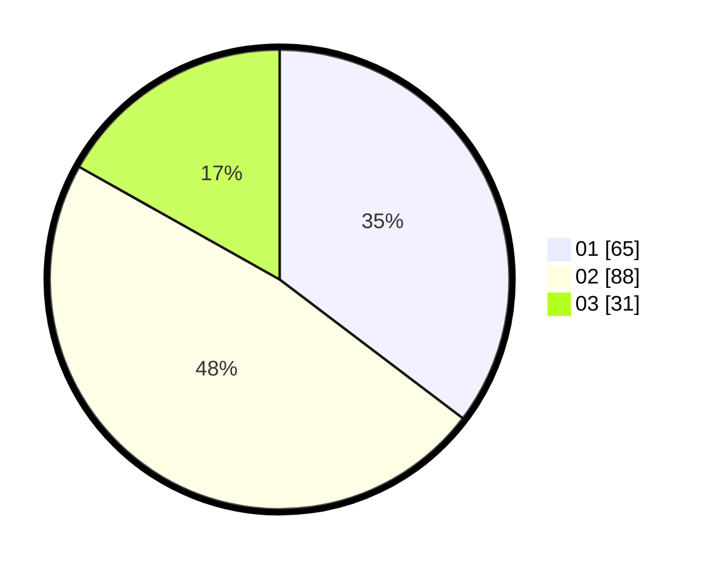

# Hasil

Hasil perolehan suara paslon dapat dilihat pada file paslon-01.txt, paslon-02.txt, dan paslon-03.txt.

Jika tidak ada, artinya data tersebut belum ada pada SIREKAP.

## Perolehan Suara

 * Paslon 01: **65**.
 * Paslon 02: **88**.
 * Paslon 03: **31**.

## Foto C Plano

https://sirekap-obj-formc.kpu.go.id/4f3f/pemilu/ppwp/31/73/03/10/03/3173031003026-20240214-202436--479d4bad-a871-4e25-aa01-e2647123b61b.jpg

https://sirekap-obj-formc.kpu.go.id/4f3f/pemilu/ppwp/31/73/03/10/03/3173031003026-20240214-202616--d8a4142b-696c-452c-aa32-f73eea01ce87.jpg

https://sirekap-obj-formc.kpu.go.id/4f3f/pemilu/ppwp/31/73/03/10/03/3173031003026-20240214-202720--0727b274-213f-412c-8d15-ed92c95fdae0.jpg

## DATA PEMILIH TETAP

Jumlah pemilih dalam DPT: **243**.
 * L: **122**.
 * P: **121**.

## DATA PENGGUNA HAK PILIH

Jumlah pengguna hak pilih dalam DPT: **183**.
 * L: **88**.
 * P: **95**.

Jumlah pengguna hak pilih dalam DPTb: **0**.
 * L: **0**.
 * P: **0**.

Jumlah pengguna hak pilih dalam DPK: **2**.
 * L: **2**.
 * P: **0**.

Jumlah pengguna hak pilih: **185**.
 * L: **90**.
 * P: **95**.

## JUMLAH SUARA SAH DAN TIDAK SAH

JUMLAH SELURUH SUARA SAH: **184**.

JUMLAH SUARA TIDAK SAH: **1**.

JUMLAH SELURUH SUARA SAH DAN SUARA TIDAK SAH: **185**.
