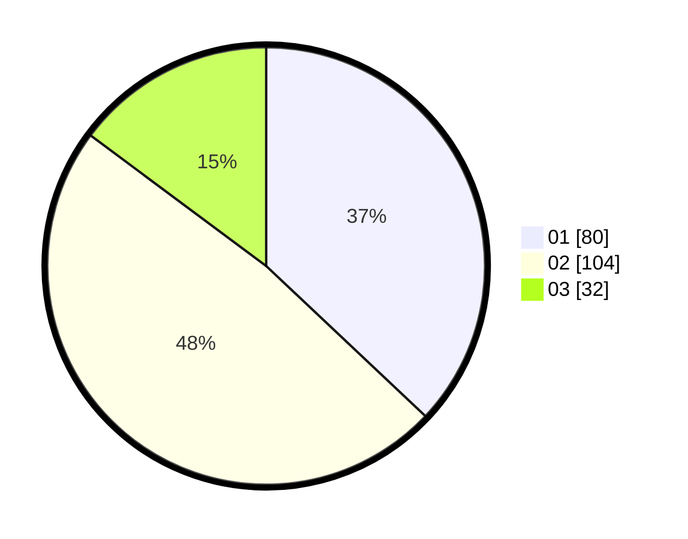

# Hasil

Hasil perolehan suara paslon dapat dilihat pada file paslon-01.txt, paslon-02.txt, dan paslon-03.txt.

Jika tidak ada, artinya data tersebut belum ada pada SIREKAP.

## Perolehan Suara

 * Paslon 01: **80**.
 * Paslon 02: **104**.
 * Paslon 03: **32**.

## Foto C Plano

https://sirekap-obj-formc.kpu.go.id/53e9/pemilu/ppwp/31/73/03/10/03/3173031003027-20240214-213221--8a913a3d-dafe-4e43-a851-03ce3ec90d0e.jpg

https://sirekap-obj-formc.kpu.go.id/53e9/pemilu/ppwp/31/73/03/10/03/3173031003027-20240214-213323--d7365061-d8e8-4b6b-b8e9-fdc8d4cb8ca7.jpg

https://sirekap-obj-formc.kpu.go.id/53e9/pemilu/ppwp/31/73/03/10/03/3173031003027-20240214-213434--c56acdb8-66e5-47ce-a3ab-59ff85aacf11.jpg

## DATA PEMILIH TETAP

Jumlah pemilih dalam DPT: **267**.
 * L: **140**.
 * P: **127**.

## DATA PENGGUNA HAK PILIH

Jumlah pengguna hak pilih dalam DPT: **217**.
 * L: **109**.
 * P: **108**.

Jumlah pengguna hak pilih dalam DPTb: **2**.
 * L: **2**.
 * P: **0**.

Jumlah pengguna hak pilih dalam DPK: **2**.
 * L: **2**.
 * P: **0**.

Jumlah pengguna hak pilih: **221**.
 * L: **113**.
 * P: **108**.

## JUMLAH SUARA SAH DAN TIDAK SAH

JUMLAH SELURUH SUARA SAH: **216**.

JUMLAH SUARA TIDAK SAH: **5**.

JUMLAH SELURUH SUARA SAH DAN SUARA TIDAK SAH: **221**.
