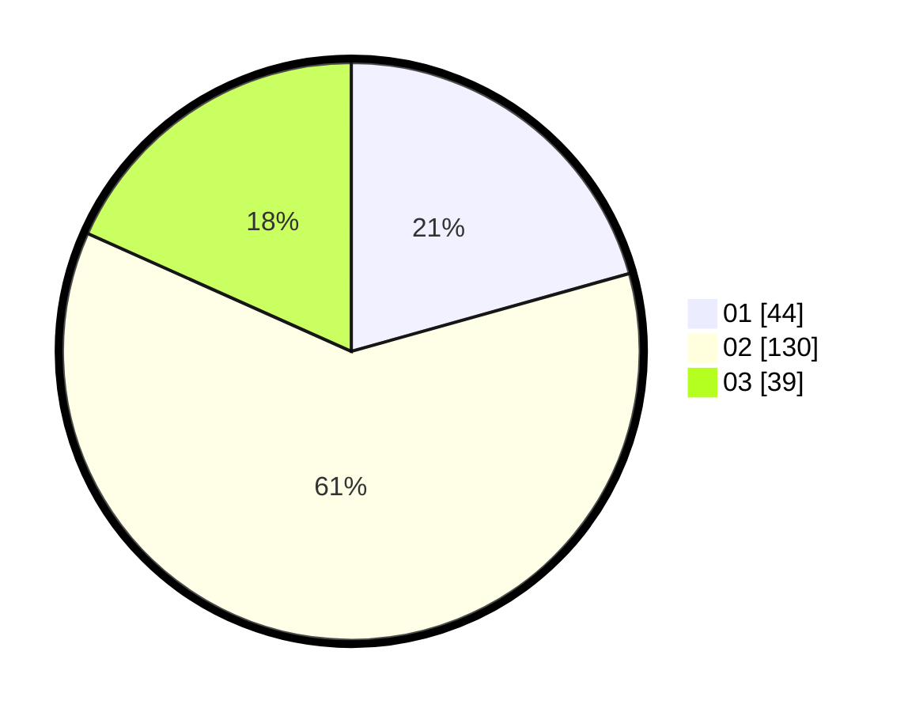

# Hasil

Hasil perolehan suara paslon dapat dilihat pada file paslon-01.txt, paslon-02.txt, dan paslon-03.txt.

Jika tidak ada, artinya data tersebut belum ada pada SIREKAP.

## Perolehan Suara

 * Paslon 01: **44**.
 * Paslon 02: **130**.
 * Paslon 03: **39**.

## Foto C Plano

https://sirekap-obj-formc.kpu.go.id/708b/pemilu/ppwp/31/73/03/10/03/3173031003029-20240214-202749--f538655a-6f4d-47ab-b718-c2beca7dff35.jpg

https://sirekap-obj-formc.kpu.go.id/708b/pemilu/ppwp/31/73/03/10/03/3173031003029-20240214-202844--df106dfc-a3ba-4344-bb59-c35e3d9d7300.jpg

https://sirekap-obj-formc.kpu.go.id/708b/pemilu/ppwp/31/73/03/10/03/3173031003029-20240214-202955--fe14c19f-f25b-42d5-9fca-26be3c0676cb.jpg

## DATA PEMILIH TETAP

Jumlah pemilih dalam DPT: **268**.
 * L: **139**.
 * P: **129**.

## DATA PENGGUNA HAK PILIH

Jumlah pengguna hak pilih dalam DPT: **214**.
 * L: **115**.
 * P: **99**.

Jumlah pengguna hak pilih dalam DPTb: **2**.
 * L: **0**.
 * P: **2**.

Jumlah pengguna hak pilih dalam DPK: **0**.
 * L: **0**.
 * P: **0**.

Jumlah pengguna hak pilih: **216**.
 * L: **115**.
 * P: **101**.

## JUMLAH SUARA SAH DAN TIDAK SAH

JUMLAH SELURUH SUARA SAH: **213**.

JUMLAH SUARA TIDAK SAH: **3**.

JUMLAH SELURUH SUARA SAH DAN SUARA TIDAK SAH: **216**.
