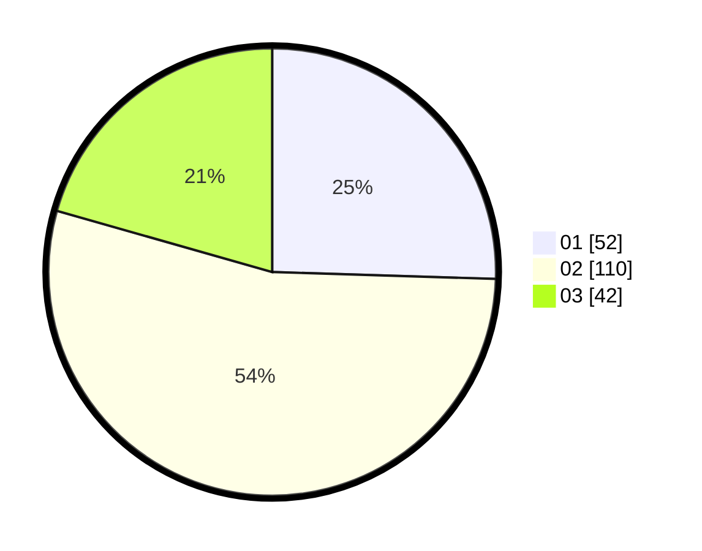

# Hasil

Hasil perolehan suara paslon dapat dilihat pada file paslon-01.txt, paslon-02.txt, dan paslon-03.txt.

Jika tidak ada, artinya data tersebut belum ada pada SIREKAP.

## Perolehan Suara

 * Paslon 01: **52**.
 * Paslon 02: **110**.
 * Paslon 03: **42**.

## Foto C Plano

https://sirekap-obj-formc.kpu.go.id/2dfa/pemilu/ppwp/31/73/03/10/03/3173031003031-20240214-222138--54932e70-9020-4294-98a1-a8eacc44503d.jpg

https://sirekap-obj-formc.kpu.go.id/2dfa/pemilu/ppwp/31/73/03/10/03/3173031003031-20240214-222435--25b2f3f8-260b-4459-8467-4f1c164f4d65.jpg

https://sirekap-obj-formc.kpu.go.id/2dfa/pemilu/ppwp/31/73/03/10/03/3173031003031-20240214-232506--c3d797b0-5f39-4c1c-9f34-b6efe90ee7da.jpg
