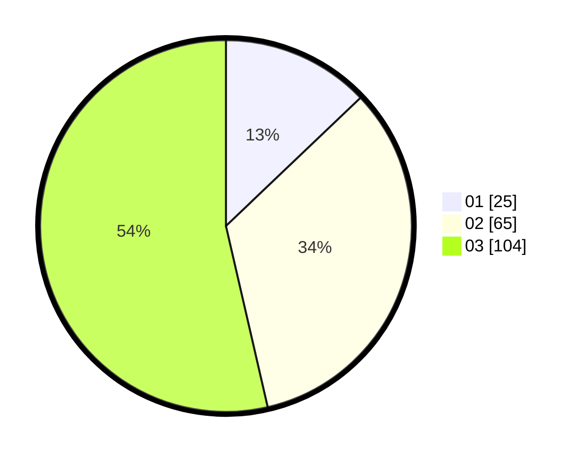

# Hasil

Hasil perolehan suara paslon dapat dilihat pada file paslon-01.txt, paslon-02.txt, dan paslon-03.txt.

Jika tidak ada, artinya data tersebut belum ada pada SIREKAP.

## Perolehan Suara

 * Paslon 01: **25**.
 * Paslon 02: **65**.
 * Paslon 03: **104**.

## Foto C Plano

https://sirekap-obj-formc.kpu.go.id/6428/pemilu/ppwp/31/73/03/10/03/3173031003032-20240214-224825--e0816cb5-689a-4c68-a3df-0e76ee3c7004.jpg

https://sirekap-obj-formc.kpu.go.id/6428/pemilu/ppwp/31/73/03/10/03/3173031003032-20240214-225055--6256c38f-871c-44d8-ad9c-f7d1f7b977b3.jpg

https://sirekap-obj-formc.kpu.go.id/6428/pemilu/ppwp/31/73/03/10/03/3173031003032-20240214-225205--9d4db291-1886-4afa-944b-ae7e0303cdce.jpg
