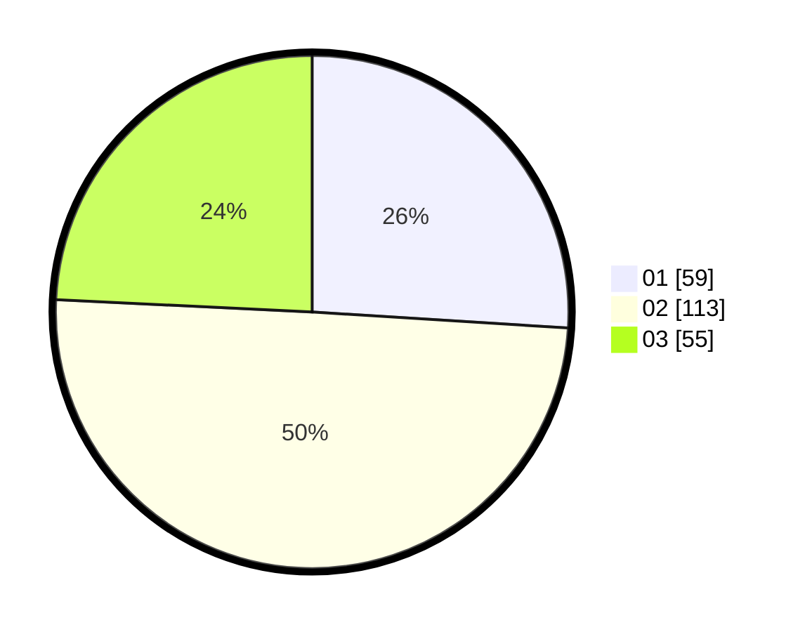

# Hasil

Hasil perolehan suara paslon dapat dilihat pada file paslon-01.txt, paslon-02.txt, dan paslon-03.txt.

Jika tidak ada, artinya data tersebut belum ada pada SIREKAP.

## Perolehan Suara

 * Paslon 01: **59**.
 * Paslon 02: **113**.
 * Paslon 03: **55**.

## Foto C Plano

https://sirekap-obj-formc.kpu.go.id/9beb/pemilu/ppwp/31/73/03/10/03/3173031003034-20240214-235722--92dd9228-5810-4709-bd55-b9d53a86812f.jpg

https://sirekap-obj-formc.kpu.go.id/9beb/pemilu/ppwp/31/73/03/10/03/3173031003034-20240214-235841--892179c1-db14-4d95-9f7a-ad7b93a3e1aa.jpg

https://sirekap-obj-formc.kpu.go.id/9beb/pemilu/ppwp/31/73/03/10/03/3173031003034-20240214-235846--9b6a8610-7ad2-4f5a-9d6d-1c95370056a7.jpg
