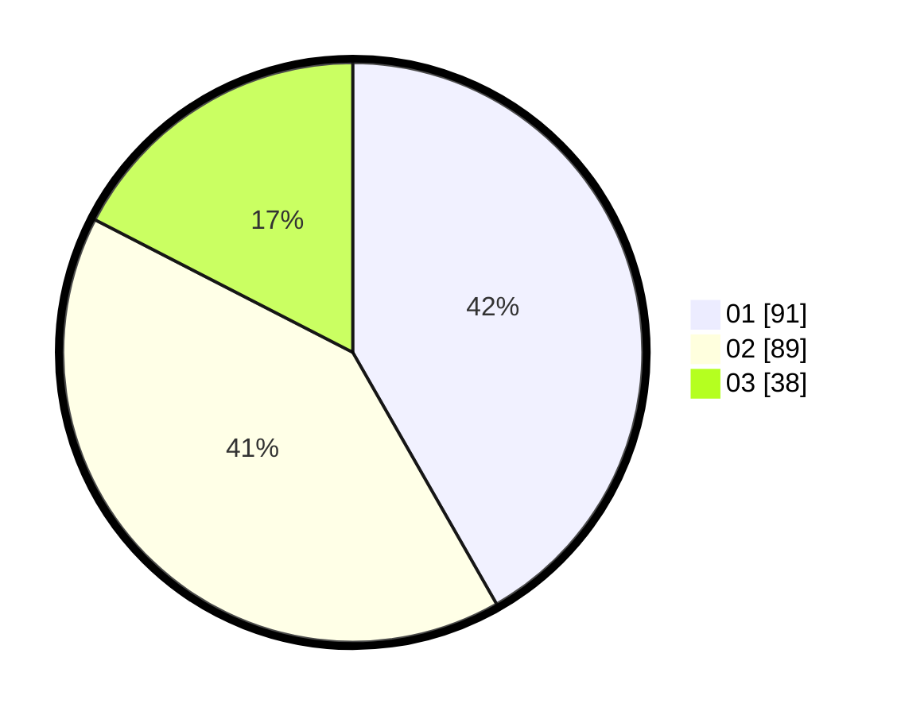

# Hasil

Hasil perolehan suara paslon dapat dilihat pada file paslon-01.txt, paslon-02.txt, dan paslon-03.txt.

Jika tidak ada, artinya data tersebut belum ada pada SIREKAP.

## Perolehan Suara

 * Paslon 01: **91**.
 * Paslon 02: **89**.
 * Paslon 03: **38**.

## Foto C Plano

https://sirekap-obj-formc.kpu.go.id/9b94/pemilu/ppwp/31/73/03/10/03/3173031003036-20240214-235052--ea5ee3d1-4b20-4fbb-93ed-9959d1bd29d9.jpg

https://sirekap-obj-formc.kpu.go.id/9b94/pemilu/ppwp/31/73/03/10/03/3173031003036-20240214-224953--d919dc8e-d348-428a-93c5-5d2f3a6eb647.jpg

https://sirekap-obj-formc.kpu.go.id/9b94/pemilu/ppwp/31/73/03/10/03/3173031003036-20240214-235741--dd89d627-542a-470f-bb89-820bb1a23e24.jpg

## DATA PEMILIH TETAP

Jumlah pemilih dalam DPT: **271**.
 * L: **130**.
 * P: **141**.

## DATA PENGGUNA HAK PILIH

Jumlah pengguna hak pilih dalam DPT: **212**.
 * L: **102**.
 * P: **110**.

Jumlah pengguna hak pilih dalam DPTb: **0**.
 * L: **0**.
 * P: **0**.

Jumlah pengguna hak pilih dalam DPK: **7**.
 * L: **3**.
 * P: **4**.

Jumlah pengguna hak pilih: **219**.
 * L: **105**.
 * P: **114**.

## JUMLAH SUARA SAH DAN TIDAK SAH

JUMLAH SELURUH SUARA SAH: **218**.

JUMLAH SUARA TIDAK SAH: **1**.

JUMLAH SELURUH SUARA SAH DAN SUARA TIDAK SAH: **219**.
